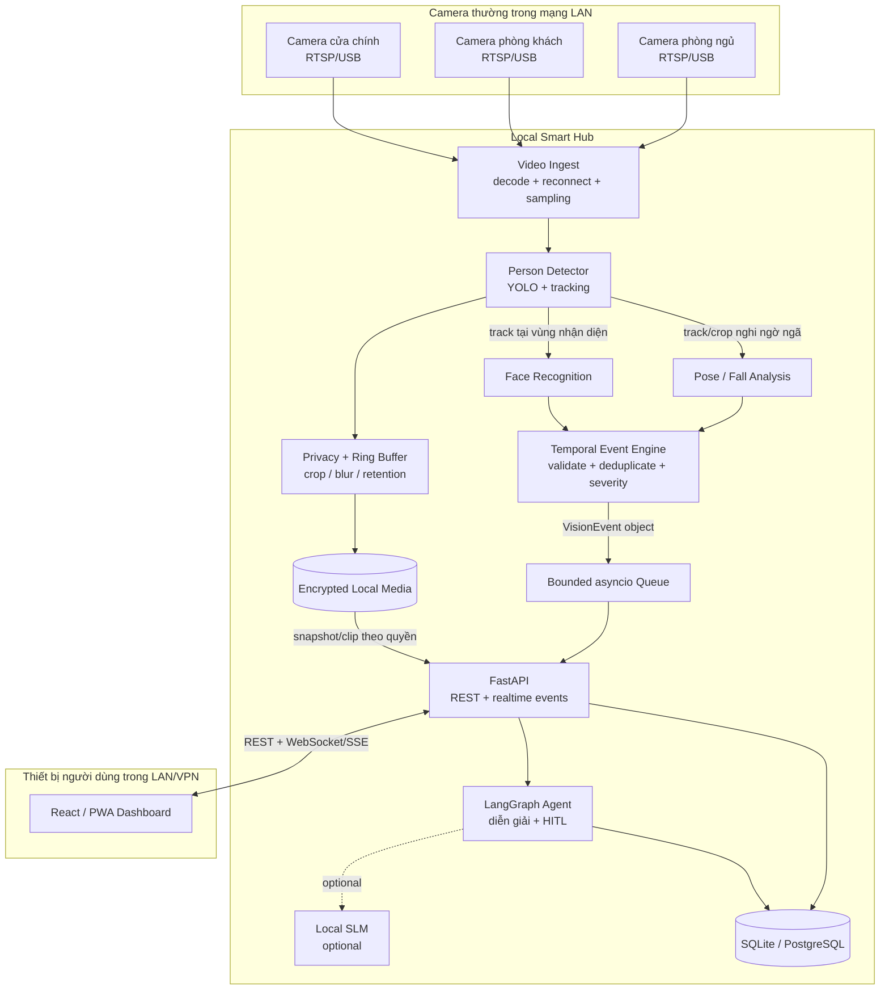
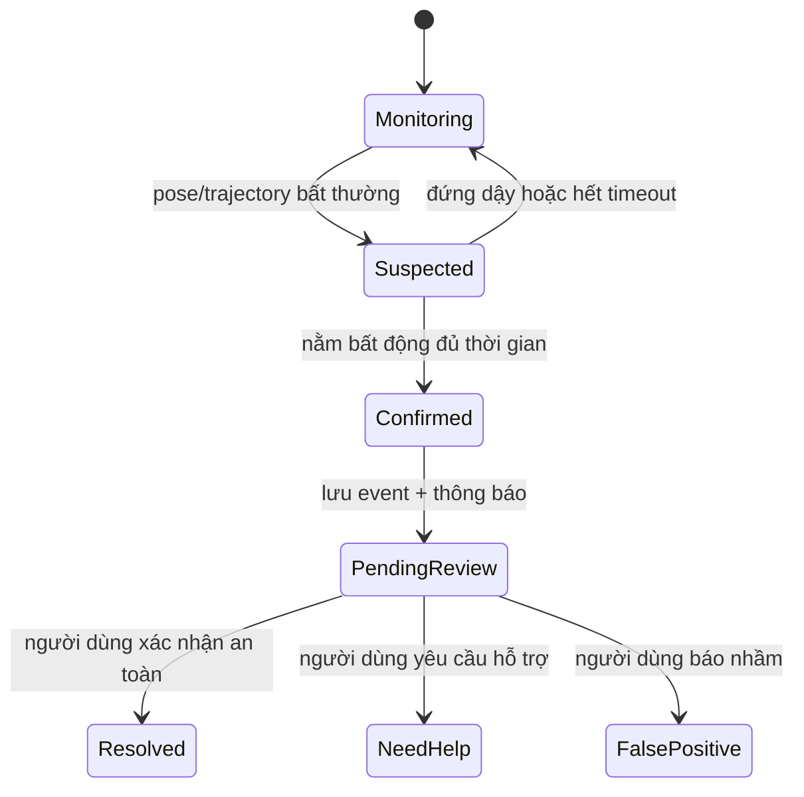

# GuardianCam Architecture

## Mục tiêu

GuardianCam sử dụng một **Local Smart Hub** để nhận luồng từ tất cả camera thường và xử lý toàn bộ Vision AI tại nhà. Video thô không được gửi lên cloud. Việc phát hiện và cảnh báo an toàn vẫn hoạt động khi mất Internet hoặc khi Agent/SLM không khả dụng.

## Kiến trúc tổng thể



## Phân chia trách nhiệm

### Camera

- Chỉ cung cấp video qua RTSP/ONVIF hoặc USB.
- Không bắt buộc có AI, GPU hay bộ nhớ sự kiện.
- Mỗi camera có `camera_id`, vị trí, URL nội bộ và chính sách riêng tư.

### Vision Service trên Local Hub

- Duy trì kết nối và giải mã nhiều camera.
- Chạy person detection và tracking trước.
- Chỉ chạy pose trên crop/track cần thiết.
- Chỉ chạy face recognition ở vùng hoặc tần suất đã cấu hình.
- Duy trì ring buffer trong RAM và chỉ ghi media khi có sự kiện.
- Không phụ thuộc Agent hoặc Internet để tạo tín hiệu nguy hiểm.

### Temporal Event Engine

- Xác nhận tín hiệu qua nhiều frame, không cảnh báo từ một frame đơn lẻ.
- Gộp sự kiện theo `camera_id` và `track_id`.
- Áp dụng cooldown, trạng thái bất động và policy severity.
- Phát `VisionEvent` qua bounded queue trong bộ nhớ; media được lưu trong volume cục bộ và event chỉ mang đường dẫn.

### Backend và Agent

- FastAPI sở hữu persistence, API, audit log, HITL và kênh realtime.
- LangGraph diễn giải sự kiện và điều phối tương tác; không quyết định trực tiếp một người có ngã hay không.
- Local SLM là tùy chọn. Khi SLM lỗi hoặc timeout, hệ thống dùng mô tả theo template.

## Event contract

```json
{
  "schema_version": 1,
  "event_id": "018f...",
  "camera_id": "living-room",
  "camera_location": "Phòng khách",
  "event_type": "FALL_SUSPECTED",
  "occurred_at": "2026-08-04T15:20:31.120+07:00",
  "confidence": 0.91,
  "track_id": "37",
  "identity_status": "UNKNOWN",
  "snapshot_ref": "events/018f/snapshot.jpg",
  "model_versions": {
    "detector": "yolo-v1",
    "pose": "pose-v1",
    "face": "face-v1"
  }
}
```

Vision pipeline tích hợp gọi `await vision_event_sink.publish(event)`. Endpoint `POST /api/v1/vision/events` dùng cùng sink để kiểm thử khi Vision chạy ở process riêng. Backend chống ghi trùng bằng `event_id`.

## Luồng cảnh báo té ngã



## Ràng buộc triển khai

- Local Hub chạy Docker Compose và hoạt động 24/7 trong LAN.
- Ưu tiên Ethernet và hardware video decode; giới hạn FPS/resolution theo tài nguyên.
- Queue có giới hạn và consumer dùng `await`, không busy-polling; event ingress HTTP chỉ mở trong Local Hub/LAN tin cậy.
- Dashboard chỉ truy cập qua LAN hoặc VPN; production dùng TLS và phân quyền.
- Face embedding, database và media được mã hóa cục bộ, có retention policy.
- Chức năng phát hiện, lưu sự kiện và cảnh báo cục bộ không yêu cầu cloud API.

## Quyết định thiết kế

| Quyết định | Lựa chọn | Lý do |
|---|---|---|
| Vị trí Vision AI | Một Local Hub | Dễ quản trị model, tận dụng GPU/NPU chung và giảm chi phí mỗi camera |
| Camera | RTSP/ONVIF/USB thông thường | Không phụ thuộc camera AI chuyên dụng |
| Event transport | Bounded in-process queue | Truyền object trực tiếp, không broker và không polling CPU |
| Media transport | Shared local volume | Event chỉ truyền đường dẫn ảnh/video |
| Safety decision | Deterministic temporal engine | Hoạt động offline, dễ kiểm thử và không phụ thuộc LLM |
| Agent | LangGraph sau Event Engine | Dùng cho diễn giải, workflow và HITL |
| Database | SQLite cho MVP | Đơn giản trên một hub; chuyển PostgreSQL khi cần đồng thời/HA |
