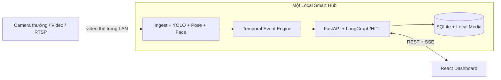
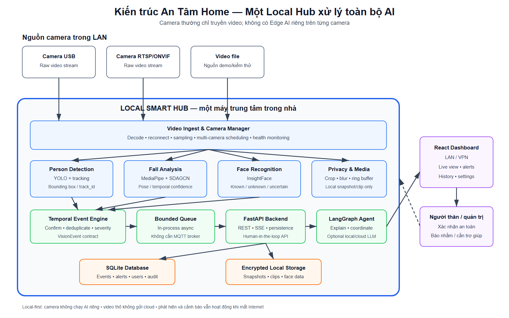

# An Tâm Home — GuardianCam Local Hub

> Hệ thống AI chạy tại nhà để phát hiện té ngã, nhận diện người lạ và hỗ trợ gia đình xử lý cảnh báo theo thời gian thực mà không phụ thuộc vào cloud.

## Vấn đề (Problem)

Người cao tuổi hoặc người sống một mình có thể gặp sự cố nhưng không thể chủ động gọi trợ giúp. Camera thông thường chỉ ghi hình; người thân phải theo dõi thủ công, dễ bỏ lỡ thời điểm quan trọng. Việc gửi video liên tục lên cloud cũng làm tăng chi phí, độ trễ và rủi ro riêng tư.

## Giải pháp (Solution)

An Tâm Home biến camera USB, video hoặc luồng RTSP thành hệ thống giám sát an toàn chạy trên Local Hub:

- Phát hiện người và ước lượng keypoint bằng YOLO/MediaPipe.
- Phân loại hành vi té ngã bằng mô hình SDAGCN trên skeleton 25 khớp.
- Nhận diện người thân và phát hiện người lạ bằng InsightFace.
- Chuẩn hóa sự kiện vision, chống ghi trùng và lưu vào SQLite.
- Phát cảnh báo realtime đến dashboard, hỗ trợ xác nhận an toàn, báo nhầm hoặc yêu cầu trợ giúp.
- Dùng LangGraph cho diễn giải và quy trình human-in-the-loop; quyết định an toàn cốt lõi không phụ thuộc LLM.

## Người dùng mục tiêu

- Chính: gia đình có người cao tuổi, người sống một mình hoặc người cần được theo dõi an toàn.
- Phụ: người chăm sóc, cơ sở chăm sóc quy mô nhỏ và nhóm vận hành hệ thống camera nội bộ.

## Tech Stack

| Lớp | Công nghệ |
|---|---|
| Vision AI | YOLO, MediaPipe, SDAGCN, InsightFace, PyTorch |
| AI workflow | LangGraph, LangChain, OpenAI tùy chọn |
| Backend | FastAPI, Python 3.11, SSE |
| Frontend | React, TypeScript, Vite |
| Database | SQLite trên Local Hub |
| DevOps | Docker Compose, GitHub Actions |
| Testing | pytest, Ruff |

## Quick Start

Yêu cầu: Windows/Linux 64-bit, Python 3.11, Node.js 20+ và webcam hoặc video mẫu.

```powershell
# 1. Clone
git clone https://github.com/AI20K-Build-Phase-Cohort-3/P-227.git
cd P-227

# 2. Python environment
python -m venv .venv
.\.venv\Scripts\Activate.ps1
Copy-Item .env.example .env
python -m pip install -r requirements.txt
python -m pip install -e vision\torchlight

# 3. Frontend
cd frontend
npm ci
Copy-Item .env.example .env
cd ..
```

Chạy backend và frontend trong hai terminal:

```powershell
# Terminal 1
.\.venv\Scripts\python.exe -m uvicorn src.main:app --reload --port 8000

# Terminal 2
cd frontend
npm run dev
```

Truy cập:

- Dashboard: `http://localhost:5173`
- Swagger API: `http://localhost:8000/docs`
- Health check: `http://localhost:8000/health`

Để chạy vision, cần đặt model local đúng vị trí được mô tả tại [docs/vision.md](docs/vision.md), sau đó:

```powershell
cd vision
..\.venv\Scripts\python.exe realtime.py
```

## Luồng hoạt động



Không có Edge AI riêng cho từng camera; mọi model và dữ liệu được quản lý tập trung trên một Local Hub.



## Cấu trúc dự án

```text
├── src/                 # FastAPI, agent, service và model API
├── vision/              # Pipeline phát hiện ngã và người lạ
├── frontend/            # Dashboard React/Vite
├── database/            # Schema, query và dữ liệu mẫu SQLite
├── tests/               # Test backend/agent/API
├── docs/                # Tài liệu kỹ thuật dự án
├── scripts/             # Setup và AI logging hooks
├── eval/                # Bằng chứng đánh giá
├── presentation/        # Tài liệu demo/pitch
├── Dockerfile
└── docker-compose.yml
```

## API chính

| Method | Endpoint | Mục đích |
|---|---|---|
| GET | `/health` | Kiểm tra backend |
| POST | `/api/v1/vision/events` | Nhận sự kiện từ vision |
| GET | `/api/v1/alerts` | Danh sách cảnh báo |
| GET | `/api/v1/alerts/stream` | Cảnh báo realtime qua SSE |
| PATCH | `/api/v1/alerts/{id}` | Human-in-the-loop review |
| GET | `/api/v1/cameras` | Danh sách camera |
| PATCH | `/api/v1/cameras/{id}/source` | Cập nhật nguồn camera |
| GET/POST | `/api/v1/persons` | Quản lý người thân |
| GET | `/api/v1/history` | Lịch sử sự kiện |
| GET | `/api/v1/overview` | Dữ liệu tổng quan dashboard |

Chi tiết tại [docs/api.md](docs/api.md).

## Kiểm tra

```powershell
.\.venv\Scripts\python.exe -m pytest -q
.\.venv\Scripts\python.exe -m ruff check src tests
cd frontend
npm run build
```

## Tài liệu

| Tài liệu | Nội dung |
|---|---|
| [docs/README.md](docs/README.md) | Mục lục tài liệu |
| [docs/setup.md](docs/setup.md) | Cài đặt và cấu hình |
| [docs/architecture.md](docs/architecture.md) | Kiến trúc và luồng dữ liệu |
| [docs/vision.md](docs/vision.md) | Vision pipeline và model |
| [docs/api.md](docs/api.md) | API và event contract |
| [docs/database.md](docs/database.md) | SQLite schema và seed |
| [docs/frontend.md](docs/frontend.md) | Dashboard React |
| [docs/deployment.md](docs/deployment.md) | Docker và vận hành |
| [docs/testing.md](docs/testing.md) | Test và quality gate |
| [docs/security.md](docs/security.md) | Quyền riêng tư và bảo mật |
| [docs/troubleshooting.md](docs/troubleshooting.md) | Xử lý lỗi thường gặp |
| [docs/roadmap.md](docs/roadmap.md) | Trạng thái và ưu tiên tiếp theo |
| [README_GUIDE.md](README_GUIDE.md) | Hướng dẫn template AI20K ban đầu |

## Trạng thái deliverables

- [x] Source code backend, frontend và vision
- [x] README và tài liệu kỹ thuật
- [x] Architecture diagram
- [x] SQLite schema và API contract
- [x] Test suite và CI workflow
- [x] AI usage logging
- [ ] Public deployment URL
- [ ] Video demo hoàn chỉnh
- [ ] Báo cáo benchmark model trên tập kiểm thử cuối

## Giới hạn hiện tại

- Model weights và dữ liệu khuôn mặt không được lưu trong Git; phải cung cấp riêng trên Local Hub.
- Vision realtime hiện ưu tiên webcam Windows và cần tiếp tục chuẩn hóa adapter RTSP/multi-camera.
- SQLite phù hợp MVP một hub; triển khai nhiều node cần database và message transport khác.
- Đây là hệ thống hỗ trợ cảnh báo, không thay thế thiết bị y tế hoặc dịch vụ khẩn cấp chuyên nghiệp.

## Nhóm phát triển

Dự án thuộc AI20K Build Phase Cohort 3. Danh sách thành viên và đóng góp được lưu trong [GitHub contributors](https://github.com/AI20K-Build-Phase-Cohort-3/P-227/graphs/contributors), `JOURNAL.md` và `WORKLOG.md`.

## License

MIT. Xem [LICENSE](vision/LICENSE) cho phần mã vision được tích hợp.
