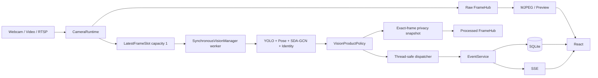

# GuardianCam Local Hub

GuardianCam là hệ thống giám sát an toàn local-first cho gia đình. Backend nhận
webcam, video file hoặc RTSP, phát video realtime cho frontend, đồng thời chạy
Vision để phát hiện té ngã và người chưa được nhận diện. Event, alert và ảnh
bằng chứng được lưu cục bộ trong SQLite/snapshot storage.

> GuardianCam là công cụ hỗ trợ cảnh báo, không thay thế thiết bị y tế, người
> chăm sóc hoặc dịch vụ khẩn cấp.

## Chức năng hiện tại

- Camera và trạng thái Camera/Vision/Identity được lưu trong SQLite và tự khôi
  phục khi backend khởi động.
- Raw MJPEG chạy theo source cadence, độc lập với tốc độ Vision.
- Production dùng canonical VisionV2 tích hợp trong `src/vision`: YOLO,
  MediaPipe Pose, SDA-GCN năm lớp và InsightFace tùy chọn.
- Một capacity-one latest-frame slot cho mỗi camera giữ latency bounded khi
  inference chậm; không có queue/backlog trước Vision.
- Video file dùng media/source timestamp; camera live dùng monotonic capture
  timestamp. Temporal decisions không phụ thuộc tốc độ máy xử lý.
- Fall Detection luôn hoạt động khi Vision ON. `Hiện khung` chỉ điều khiển
  presentation. `Phát hiện người lạ` điều khiển toàn bộ identity workflow.
- Event snapshot lấy đúng event frame và chỉ được lưu khi privacy blur an toàn.
- Event/alert vẫn được lưu và phát SSE nếu snapshot hoặc media metadata lỗi.
- CUDA được ưu tiên khi có; tiếp theo là OpenVINO Intel GPU; cuối cùng CPU.
  InsightFace dùng DirectML hoặc CPU theo provider thực tế.

## Stack

| Thành phần | Công nghệ |
|---|---|
| Vision | Ultralytics YOLO, MediaPipe, SDA-GCN, InsightFace |
| Accelerator | CUDA, OpenVINO Intel GPU, ONNX Runtime DirectML, CPU fallback |
| Backend | Python 3.11, FastAPI, Uvicorn, SSE |
| Frontend | React, TypeScript, Vite |
| Persistence | SQLite, local snapshot files |
| Kiểm thử | pytest, Ruff, TypeScript/Vite build |

## Yêu cầu

- Python 3.11 64-bit.
- Node.js 20+.
- Windows 10/11 hoặc Linux 64-bit.
- Webcam, video local hoặc RTSP nếu dùng source thật.
- Các model canonical trong `src/vision`.
- InsightFace `buffalo_l` chỉ khi bật Identity.

## Cài nhanh trên Windows

Chi tiết đầy đủ nằm tại [QUICKSTART.md](QUICKSTART.md).

```cmd
git clone https://github.com/AI20K-Build-Phase-Cohort-3/P-227.git
cd P-227
python -m venv .venv
.venv\Scripts\activate
python -m pip install --upgrade pip
python -m pip install -r requirements/vision-intel.txt
cd frontend
npm.cmd ci
cd ..
copy /Y .env.example .env
```

Chọn đúng dependency profile:

| Profile | File |
|---|---|
| Intel Iris Xe / Windows | `requirements/vision-intel.txt` |
| NVIDIA CUDA 12.4 | `requirements/vision-cuda.txt` |
| CPU/Docker | `requirements/vision-cpu.txt` |
| Backend/test không chạy Real Vision | `requirements/base.txt` |

`requirements.txt` chỉ là compatibility alias cho base, không đủ để chạy Real
Vision. `requirements-lock-cpu.txt` là lock file của môi trường Windows CPU đã
được kiểm chứng.

## Cấu hình

Copy `.env.example` thành `.env`. Cấu hình Vision chính:

```dotenv
DATABASE_URL=sqlite:///./data/app.db

VISION_ENGINE=canonical
VISION_DEVICE=auto
VISION_YOLO_PATH=yolov8n.pt
VISION_CONFIG_PATH=work_dir/fall_detection/joint/config.yaml
VISION_CHECKPOINT_PATH=work_dir/fall_detection/joint/runs-best_val.pt
VISION_MODEL_CACHE_DIR=data/vision-cache

VISION_IDENTITY_ENABLED=false
VISION_IDENTITY_PROVIDER=auto
VISION_INSIGHTFACE_ROOT=~/.insightface
```

- `VISION_ENGINE=canonical` là production path; `mock` chỉ dùng cho test/smoke.
- `VISION_DEVICE=auto` chọn CUDA → OpenVINO Intel GPU → CPU và log runtime thật.
- Giữ `VISION_IDENTITY_ENABLED=false` nếu chưa có
  `<VISION_INSIGHTFACE_ROOT>/models/buffalo_l/`.
- Known-person production lấy từ `persons`/`face_profiles` trong database qua
  `FaceGallery`, không cần cấu hình thư mục ảnh thủ công.
- Các biến temporal target-rate/buffer cũ không điều khiển canonical production
  path hiện tại.
- Không commit `.env`, credential, database, snapshots hoặc dữ liệu sinh trắc.

Model bắt buộc:

```text
src/vision/yolov8n.pt
src/vision/work_dir/fall_detection/joint/config.yaml
src/vision/work_dir/fall_detection/joint/runs-best_val.pt
```

## Chạy ứng dụng

Backend:

```cmd
cd /d D:\VinAI\Project\P-227
.venv\Scripts\activate
python -m uvicorn src.main:app --host 127.0.0.1 --port 8000
```

Frontend ở terminal khác:

```cmd
cd /d D:\VinAI\Project\P-227\frontend
npm.cmd run dev
```

- Web: <http://localhost:5173>
- Swagger: <http://127.0.0.1:8000/docs>
- Health: <http://127.0.0.1:8000/health>

Vite proxy `/api` và `/snapshots` sang backend. `ECONNREFUSED` đồng thời ở nhiều
endpoint nghĩa là backend không listen, không phải một API riêng trả lỗi.

## Kiến trúc runtime



Renderer kết hợp raw frame hiện tại với latest VisionResult chỉ khi cùng
`source_epoch` và không stale quá `0.75s`. Viewer không tạo model, capture hoặc
inference riêng.

## Controls và semantics

| Control | Behavior |
|---|---|
| Vision OFF | Không xử lý Vision |
| Vision ON | Fall Detection luôn ON |
| Hiện khung OFF | Chỉ ẩn bbox/overlay; inference và event vẫn chạy |
| Phát hiện người lạ OFF | Tắt identity inference/retry/event/overlay; Fall không đổi |

Unknown cần 5 face+embedding observations hợp lệ, cách nhau tối thiểu 1 giây
source time. Face miss không tăng confirmation count. Unknown score trên UI là:

```text
Mức độ không khớp = 1 - clamp(closest known cosine similarity, 0, 1)
```

Đây không phải calibrated probability. `general.stranger_threshold` được đọc
từ database và áp dụng live, không cần restart.

## API chính

| Method | Endpoint | Chức năng |
|---|---|---|
| `GET` | `/health` | Process health |
| `GET` | `/api/v1/cameras` | Camera desired/observed state |
| `POST` | `/api/v1/cameras/{id}/start` | Bật camera |
| `POST` | `/api/v1/cameras/{id}/stop` | Tắt camera |
| `GET` | `/api/v1/cameras/{id}/stream` | MJPEG |
| `GET` | `/api/v1/cameras/{id}/preview` | Latest raw JPEG |
| `POST` | `/api/v1/cameras/{id}/vision/enable` | Bật Vision |
| `POST` | `/api/v1/cameras/{id}/vision/disable` | Tắt Vision |
| `PATCH` | `/api/v1/cameras/{id}/vision/identity` | Bật/tắt Unknown workflow |
| `GET` | `/api/v1/cameras/{id}/vision/status` | Vision/device/realtime metrics |
| `GET` | `/api/v1/alerts` | Alerts persisted |
| `GET` | `/api/v1/alerts/stream` | Realtime SSE |
| `GET` | `/api/v1/settings` | Settings persisted |
| `PATCH` | `/api/v1/settings/general` | Threshold/general settings áp dụng live |

Xem contract đầy đủ tại [docs/api.md](docs/api.md).

## Kiểm thử

```cmd
.venv\Scripts\python.exe -m pytest -q
.venv\Scripts\python.exe -m ruff check src tests
cd frontend
npm.cmd run build
cd ..
git diff --check
```

API tests cô lập native AI ở application boundary. Các pipeline/service tests
vẫn kiểm tra temporal state, latest-frame race, privacy, DB và event contracts.
Mock tests không thay thế native runtime smoke.

## Repository

```text
P-227/
├── src/                    # Production backend và canonical Vision
├── frontend/               # React/Vite UI
├── database/schema.sql     # SQLite schema
├── tests/                  # API/service/Vision regressions
├── docs/                   # Tài liệu kỹ thuật
├── tools/                  # Benchmark/parity utilities
├── visionv2/               # Standalone reference/oracle; production không import
├── data/app.db             # Runtime data, không commit
└── snapshots/              # Event evidence, không commit
```

`visionv2/runtimev2` và `visionv2/P-227-thi` là reference/oracle, không phải
production import path và không được dùng để thay thế `src/vision`.

## Privacy và persistence

- Raw video không được gửi cloud bởi Vision pipeline.
- Snapshot chỉ dùng đúng event frame.
- Privacy fallback: exact face bbox → CPU full-frame face detector → person crop
  → rotated crops → pose/head ROI → omit snapshot nếu vẫn không an toàn.
- Không blur toàn frame và không lưu khuôn mặt visible để “có ảnh”.
- Snapshot/media lỗi không rollback event/alert hoặc chặn SSE.
- SQLite, snapshot và face embedding là dữ liệu nhạy cảm; backup database và
  snapshot cùng nhau.

## Tài liệu

- [Quickstart](QUICKSTART.md)
- [Setup và troubleshooting](docs/setup.md)
- [Architecture](docs/architecture.md)
- [Architecture diagrams](docs/architecture_diagram.md)
- [API](docs/api.md)
- [Testing](docs/testing.md)
- [Current implementation verification](docs/current-verification.md)
- [Historical Intel benchmark](docs/vision-benchmark.md)
- [Gate 1 report](docs/Gate1.md)

## License

Phần Vision tích hợp sử dụng giấy phép tại [src/vision/LICENSE](src/vision/LICENSE).
