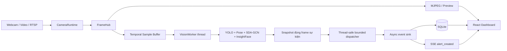

# GuardianCam Local Hub

GuardianCam là hệ thống giám sát an toàn chạy tại nhà: tiếp nhận webcam, video hoặc RTSP; phát hiện té ngã và người chưa được nhận diện; sau đó lưu và gửi cảnh báo theo thời gian thực tới giao diện web. Video thô và ảnh sự kiện được xử lý cục bộ trên Local Hub.

> Đây là công cụ hỗ trợ cảnh báo, không thay thế thiết bị y tế hoặc dịch vụ khẩn cấp.

## Chức năng hiện có

- Quản lý nhiều camera từ một SQLite database: tên, vị trí, nguồn phát và trạng thái bật/tắt.
- Phát MJPEG liên tục ở trang Camera; tổng quan dùng ảnh preview gần nhất.
- Một canonical VisionV2 pipeline dùng chung Local Hub: YOLO, MediaPipe và SDA-GCN năm lớp/joint.
- InsightFace nhận diện người thân và phát hiện người chưa có trong danh sách.
- Tự động dùng OpenVINO trên Intel GPU khi khả dụng; CPU fallback và DirectML identity đều được báo rõ.
- Lấy mẫu theo source timeline, bounded buffer và bỏ frame khi quá tải để không chặn camera.
- Chuyển event từ Vision thread sang asyncio bằng bounded, non-blocking dispatcher.
- Chống ghi trùng, lưu SQLite, tạo snapshot từ đúng frame phát hiện và phát cảnh báo qua SSE.
- Dashboard cho phép xem cảnh báo, xác nhận an toàn, báo sai và quản lý người thân.

## Công nghệ

| Thành phần | Công nghệ |
|---|---|
| Vision | Ultralytics YOLO, MediaPipe, SDA-GCN, InsightFace |
| Inference | OpenVINO Intel GPU, PyTorch fallback, ONNX Runtime DirectML cho identity |
| Backend | Python 3.11, FastAPI, Uvicorn, SSE |
| Frontend | React, TypeScript, Vite |
| Dữ liệu | SQLite và snapshot lưu cục bộ |
| Agent tùy chọn | LangGraph, LangChain, OpenAI |
| Kiểm thử | pytest, Ruff, TypeScript/Vite build |

## Yêu cầu

- Python 3.11 64-bit.
- Node.js 20 trở lên.
- Windows 10/11 hoặc Linux 64-bit.
- Webcam, video local hoặc URL RTSP nếu chạy camera thật.
- Model local tương ứng với `VISION_ENGINE`; tài nguyên InsightFace nếu bật identity.

Máy không có CUDA vẫn chạy được. Cấu hình Windows đã kiểm chứng dùng OpenVINO cho YOLO/SDA-GCN trên Intel Iris Xe và DirectML cho InsightFace nếu provider có sẵn.

## Chạy nhanh trên Windows

Hướng dẫn đầy đủ từ lúc clone nằm tại [QUICKSTART.md](QUICKSTART.md). Tóm tắt
trong CMD:

```cmd
git clone https://github.com/AI20K-Build-Phase-Cohort-3/P-227.git
cd P-227
python -m venv .venv
.venv\Scripts\activate
python -m pip install --upgrade pip
python -m pip install -r requirements/vision-intel.txt
cd frontend
npm.cmd ci
cd ..
copy /Y .env.example .env
```

Dependency được tách theo runtime để developer không phải cài mọi accelerator:

- `requirements/base.txt`: backend, preprocessing và test dùng chung.
- `requirements/vision-intel.txt`: Intel Iris Xe/OpenVINO/DirectML.
- `requirements/vision-cuda.txt`: NVIDIA CUDA 12.4.
- `requirements/vision-cpu.txt`: CPU/Docker portable fallback.
- `requirements.txt`: compatibility alias chỉ tới base; chưa đủ cho Real Vision.
- `requirements-lock-cpu.txt`: bản khóa chính xác của môi trường Windows, Torch CPU và DirectML đã kiểm chứng.

Muốn tái tạo đúng môi trường đã kiểm chứng:

```cmd
python -m pip install -r requirements-lock-cpu.txt
```

## Cấu hình `.env`

Tạo `.env` tại root. Cấu hình tối thiểu để chạy Vision thực:

```dotenv
APP_ENV=development
APP_HOST=127.0.0.1
APP_PORT=8000
LOG_LEVEL=INFO
CORS_ORIGINS=http://localhost:5173
DATABASE_URL=sqlite:///./data/app.db

VISION_ENGINE=canonical
VISION_DEVICE=auto
VISION_YOLO_PATH=yolov8n.pt
VISION_CONFIG_PATH=work_dir/fall_detection/joint/config.yaml
VISION_CHECKPOINT_PATH=work_dir/fall_detection/joint/runs-best_val.pt
VISION_MODEL_CACHE_DIR=data/vision-cache
VISION_IDENTITY_ENABLED=false
VISION_IDENTITY_PROVIDER=auto
VISION_INSIGHTFACE_ROOT=C:/Users/<user>/.insightface
VISION_KNOWN_FACES_DIR=register face
VISION_TEMPORAL_TARGET_SAMPLE_RATE=5
VISION_TEMPORAL_BUFFER_CAPACITY=8

OPENAI_API_KEY=
MODEL_NAME=gpt-4o-mini
```

Ghi chú:

- `VISION_ENGINE=canonical` là production path duy nhất; `mock` chỉ dùng cho test.
- `VISION_DEVICE=auto` ưu tiên native CUDA nếu có, sau đó OpenVINO Intel GPU,
  cuối cùng CPU; mọi fallback đều được log.
- `VISION_IDENTITY_PROVIDER=auto` ưu tiên CUDA provider trên NVIDIA, DirectML
  trên Intel/Windows, sau đó CPU.
- Target 5 Hz là kết quả acceptance trên Iris Xe: 1–2 cameras giữ đúng fall
  semantics và zero drops; 6–10 Hz không giữ đủ hai fall của fixed video.
- Chỉ bật identity sau khi đã cài đủ InsightFace `buffalo_l`; fall detection không phụ thuộc identity.
- Các đường dẫn Vision tương đối được tính từ `src/vision`; cũng có thể dùng đường dẫn tuyệt đối.
- Không đưa API key, RTSP credentials, database, snapshot hoặc dữ liệu khuôn mặt vào Git.

## Tài nguyên model

Canonical production yêu cầu:

```text
src/vision/yolov8n.pt
src/vision/work_dir/fall_detection/joint/config.yaml
src/vision/work_dir/fall_detection/joint/runs-best_val.pt
<VISION_INSIGHTFACE_ROOT>/models/buffalo_l/
```

`buffalo_l` chỉ bắt buộc khi `VISION_IDENTITY_ENABLED=true`.

Checkpoint SDA-GCN được load strict. Không tự đổi graph, tensor shape, window, stride, preprocessing hoặc class mapping để né lỗi checkpoint.

## Chạy ứng dụng

Mở hai cửa sổ CMD.

Backend:

```cmd
cd /d D:\VinAI\Project\P-227
.venv\Scripts\activate
python -m uvicorn src.main:app --host 127.0.0.1 --port 8000
```

Frontend:

```cmd
cd /d D:\VinAI\Project\P-227\frontend
npm.cmd run dev
```

Truy cập:

- Dashboard: <http://localhost:5173>
- Swagger API: <http://127.0.0.1:8000/docs>
- Health check: <http://127.0.0.1:8000/health>

Vite tự proxy `/api` và `/snapshots` sang backend port 8000. Nếu thấy `ECONNREFUSED`, backend chưa chạy hoặc đang chạy sai port. Nếu Uvicorn báo `Errno 10048`, port 8000 đã có tiến trình khác sử dụng.

## Luồng xử lý



Khi Vision chậm hơn camera, hệ thống giữ frame mới nhất và ghi nhận `dropped_frames` thay vì để camera hoặc frontend bị block. Có thể xem trạng thái bằng endpoint Vision status của từng camera.

## API chính

| Method | Endpoint | Chức năng |
|---|---|---|
| `GET` | `/health` | Kiểm tra backend |
| `GET` | `/api/v1/cameras` | Danh sách và trạng thái camera |
| `GET/PATCH/DELETE` | `/api/v1/cameras/{id}` | Xem, sửa hoặc xoá camera đã tắt |
| `POST` | `/api/v1/cameras/{id}/start` | Bật camera |
| `POST` | `/api/v1/cameras/{id}/stop` | Tắt camera |
| `GET` | `/api/v1/cameras/{id}/stream` | Luồng MJPEG |
| `GET` | `/api/v1/cameras/{id}/preview` | Ảnh gần nhất |
| `POST` | `/api/v1/cameras/{id}/vision/enable` | Bật Vision |
| `POST` | `/api/v1/cameras/{id}/vision/disable` | Tắt Vision |
| `GET` | `/api/v1/cameras/{id}/vision/status` | Metrics, device và temporal status |
| `GET` | `/api/v1/alerts` | Danh sách cảnh báo |
| `GET` | `/api/v1/alerts/stream` | Cảnh báo realtime qua SSE |
| `PATCH` | `/api/v1/alerts/{id}` | Human-in-the-loop review |
| `GET/POST` | `/api/v1/persons` | Danh sách hoặc thêm người thân |
| `GET` | `/api/v1/history` | Lịch sử sự kiện |
| `GET` | `/api/v1/overview` | Dữ liệu tổng quan |

## Kiểm thử

Backend regression nên chạy bằng Mock engine để độc lập với model và phần cứng:

```cmd
set VISION_ENGINE=mock
set VISION_IDENTITY_ENABLED=false
python -m pytest -q
python -m pip check
```

Frontend:

```cmd
cd frontend
npm.cmd run build
```

Smoke dependency và provider:

```cmd
python -c "import torch, onnxruntime as ort; print(torch.__version__, torch.cuda.is_available()); print(ort.get_available_providers())"
```

## Cấu trúc repository

```text
P-227/
├── visionv2/               # Standalone oracle/reference, không được production import
├── src/
│   ├── api/                 # FastAPI routes
│   ├── services/            # Camera, event, database và runtime services
│   └── vision/              # Canonical integrated Vision
├── frontend/                # React/Vite dashboard
├── database/schema.sql      # SQLite schema và triggers
├── data/app.db              # Database local, sinh khi chạy
├── snapshots/               # Ảnh bằng chứng local
├── tests/                   # Backend, API, Vision và regression tests
├── docs/                    # Tài liệu kỹ thuật
├── tools/                   # Parity và hardware benchmark runners
├── requirements/            # Base/Intel/CUDA/CPU profiles
├── requirements.txt
└── requirements-lock-cpu.txt
```

## Dữ liệu và quyền riêng tư

- Video thô không được gửi lên cloud bởi pipeline Vision.
- Snapshot chỉ được tạo khi có event và được phục vụ qua `/snapshots`.
- SQLite, snapshot, model riêng và embedding khuôn mặt phải được bảo vệ như dữ liệu nhạy cảm.
- Chỉ camera đã tắt và không còn lịch sử ràng buộc mới được xoá.
- `alert_actions` là lịch sử append-only theo thiết kế database.

## Tài liệu liên quan

- [Quickstart Windows CMD](QUICKSTART.md)
- [Cài đặt và troubleshooting](docs/setup.md)
- [Kiến trúc](docs/architecture.md)
- [Sơ đồ kiến trúc](docs/architecture_diagram.md)
- [API](docs/api.md)
- [Kiểm thử](docs/testing.md)
- [Vision benchmark và architecture decision](docs/vision-benchmark.md)
- [Gate 1](docs/Gate1.md)

## License

Phần Vision tích hợp sử dụng giấy phép tại [src/vision/LICENSE](src/vision/LICENSE). Xem lịch sử repository để biết thông tin đóng góp của nhóm AI20K Build Phase Cohort 3.
