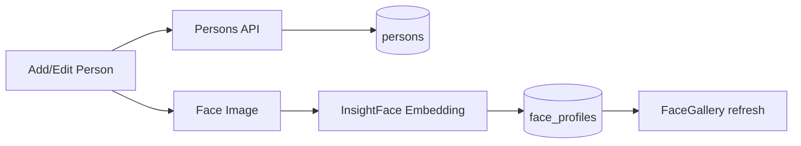
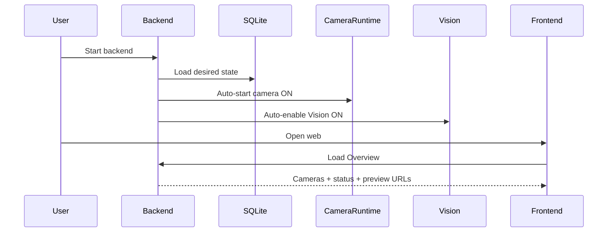
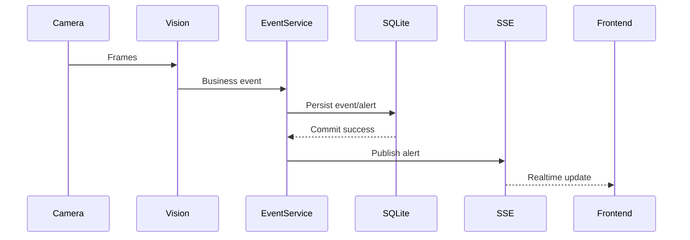
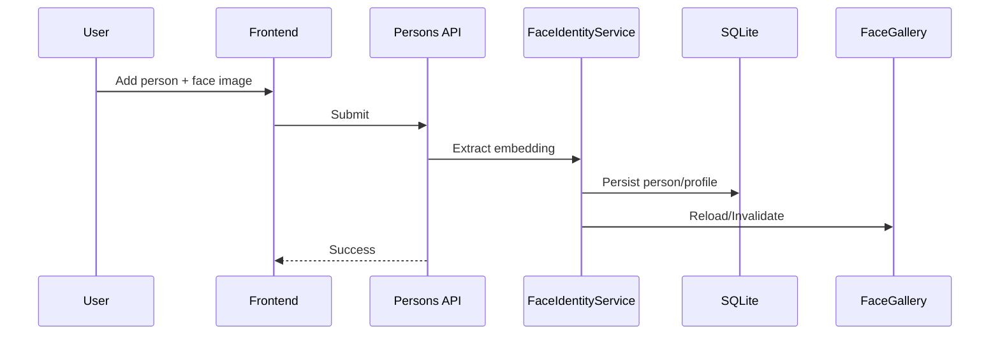

# Gate 1 — GuardianCam Local Hub

> Đây là artifact yêu cầu/scope của Gate 1 nên các cụm “V1” trong tài liệu này
> chỉ phiên bản sản phẩm tại thời điểm Gate 1. Trạng thái runtime hiện hành,
> bao gồm Vision V1/V2, được mô tả tại [architecture.md](architecture.md),
> [setup.md](setup.md) và [testing.md](testing.md).

> **Gate 1 submission:** Brief + PRD + Wireframe/UI Flow + GitHub Repo & AI Log Setup.

GuardianCam là một Local Hub giám sát an toàn cho gia đình, nhận webcam/video/RTSP, chạy Vision cục bộ để hỗ trợ phát hiện té ngã và nhận diện người thân/người chưa được đăng ký, sau đó lưu sự kiện và hiển thị cảnh báo realtime trên web.

> GuardianCam là công cụ hỗ trợ cảnh báo, không thay thế thiết bị y tế, người chăm sóc hoặc dịch vụ khẩn cấp.

---

# 1. Brief

## 1.1 Problem

Camera gia đình chủ yếu cung cấp hình ảnh hoặc bản ghi. Người thân/người chăm sóc vẫn phải chủ động mở camera và theo dõi, trong khi các tình huống như té ngã có thể xảy ra bất ngờ.

GuardianCam tập trung vào các pain point:

- Người thân không thể quan sát camera liên tục.
- Một luồng video không tự biến thành cảnh báo có ngữ nghĩa.
- Phát hiện té ngã cần diễn biến theo thời gian, không chỉ một frame.
- Nhận diện người chưa đăng ký cần một danh sách người thân đáng tin cậy.
- Dữ liệu camera trong nhà có tính riêng tư cao nên ưu tiên xử lý local.

> **Evidence note:** repository hiện chưa có một study định lượng đủ để đưa các con số như “giảm X% thời gian” hay “Y% hộ gia đình”. Không tự thêm số liệu chưa được kiểm chứng vào Gate 1. Nếu chương trình yêu cầu evidence định lượng, bổ sung artifact riêng trong `eval/`.

## 1.2 Target User

### Primary

Gia đình có người cao tuổi hoặc thành viên cần được theo dõi an toàn tại nhà.

### Secondary

Người thân/người chăm sóc cần:

- xem trạng thái camera;
- xem live stream khi cần;
- nhận cảnh báo;
- quản lý người thân;
- xem lại lịch sử sự kiện;
- không phải quan sát video liên tục.

## 1.3 Solution

GuardianCam dùng một Local Hub tại nhà:

```text
Webcam / Video / RTSP
        ↓
CameraRuntime
        ↓
FrameHub
   ├── Overview Preview
   ├── Camera MJPEG
   └── Vision
         ↓
YOLO + Pose + SDA-GCN + InsightFace
         ↓
Business Event
         ↓
EventService
   ├── SQLite
   └── SSE
         ↓
React Web
```

Các điểm chính:

- Một Local Hub quản lý nhiều camera.
- Camera state và Vision desired state được persist trong SQLite.
- Backend restart sẽ tự restore các camera/Vision đã được bật.
- Vision không sở hữu camera capture riêng.
- Overview dùng static preview nhẹ.
- Camera page dùng live MJPEG.
- Face identity production lấy từ database.
- Alert được persist trước khi phát realtime qua SSE.
- Một camera lỗi không làm toàn bộ hub lỗi.

## 1.4 Value Proposition

**GuardianCam biến camera gia đình từ một nguồn video thụ động thành một hệ thống giám sát local-first có cảnh báo và lịch sử sự kiện.**

Khác biệt V1:

- không cần AI box riêng cho từng camera;
- critical path không phụ thuộc LLM;
- database là source of truth của product state;
- face gallery production không dùng thư mục ảnh thủ công;
- bounded buffering để bảo vệ latency/memory;
- degraded capacity được báo trung thực thay vì che frame drop.

## 1.5 Product Scope V1

### In scope

- Camera CRUD.
- Webcam/video/RTSP source contract.
- Persisted desired state.
- Startup auto-restore.
- Overview static preview.
- Camera live MJPEG.
- Fall detection pipeline.
- Face identity khi bật.
- Persons + face profiles database.
- Alerts + SSE.
- History.
- Settings.
- Event snapshots.
- Human review.
- CPU fallback.
- Failure isolation.

### Out of scope

- Chứng nhận thiết bị y tế.
- Cam kết zero false positive/false negative.
- Gọi cấp cứu tự động.
- Multi-hub/high availability.
- Distributed message broker.
- Cloud video storage mặc định.
- Runtime model retraining.
- LLM quyết định tín hiệu fall/unknown.
- Tuyên bố multi-camera strict khi chưa benchmark hardware phù hợp.

---

# 2. PRD — Product Requirements Document

## 2.1 Product Goal

Sau khi cài đặt, normal product flow phải là:

```text
Start Backend
      +
Start Frontend
      ↓
Open Web
      ↓
Overview hoạt động ngay từ database
```

Người dùng bình thường không cần mở Swagger để:

- start camera;
- enable Vision;
- populate frontend;
- copy face images vào thư mục legacy.

## 2.2 Product Principles

1. **Database-backed:** camera, persons, settings, alerts/history và desired state lấy từ backend/database.
2. **Local-first:** critical Vision pipeline không cần cloud.
3. **Camera independent from Vision:** Vision error không làm camera offline.
4. **Bounded runtime:** không có unbounded frame backlog.
5. **Honest observability:** overload/degraded phải được báo.
6. **No dead UI:** nút hiển thị cho user phải có backend behavior thật hoặc bị loại bỏ.
7. **Failure isolation:** một camera/source lỗi không làm toàn application fail.

## 2.3 Main User Stories

### US-01 — Xem tổng quan

**Là người thân**, tôi muốn mở web và thấy tất cả camera, trạng thái và ảnh gần nhất để biết hệ thống đang hoạt động thế nào mà không mở tất cả live stream.

Acceptance:

- root route mở Overview;
- camera list lấy từ DB;
- có online/offline/error state;
- có static preview hoặc placeholder;
- không mở toàn bộ MJPEG stream.

### US-02 — Xem camera live

**Là người thân**, tôi muốn chọn một camera để xem video trực tiếp.

Acceptance:

- camera lấy từ DB;
- live source đúng persisted config;
- camera online mở MJPEG;
- camera offline/error có UI state rõ;
- chỉ camera đang chọn mở live stream.

### US-03 — Khôi phục hệ thống sau restart

**Là người dùng**, tôi muốn backend restart nhưng các camera/Vision đã bật tự hoạt động lại.

Acceptance:

- desired ON → auto restore;
- desired OFF → vẫn OFF;
- một camera lỗi không block camera khác;
- không cần gọi manual Swagger startup.

### US-04 — Nhận cảnh báo

**Là người chăm sóc**, tôi muốn xem alert đã lưu và nhận alert mới realtime.

Acceptance:

- initial data bằng REST;
- update bằng SSE;
- event persist trước khi SSE;
- không duplicate UI item;
- snapshot chỉ hiện khi file hợp lệ.

### US-05 — Quản lý người thân

**Là người dùng**, tôi muốn thêm/sửa/deactivate người thân và đăng ký khuôn mặt từ web.

Acceptance:

- Persons lấy từ SQLite;
- face image được backend xử lý;
- embedding/profile được persist;
- FaceGallery refresh không cần restart;
- không cần copy ảnh vào `register face/`.

### US-06 — Thay đổi cài đặt

**Là người dùng**, tôi muốn thay camera/Vision settings và giữ lại sau restart.

Acceptance:

- UI đọc current settings;
- update gọi backend;
- backend update persistence + runtime khi cần;
- reload/restart vẫn giữ.

### US-07 — Xem lịch sử

**Là người dùng**, tôi muốn xem lại lịch sử sự kiện đã persist.

Acceptance:

- không dùng mock data;
- event/media lấy DB;
- snapshot missing được biểu diễn trung thực.

## 2.4 Functional Requirements

| ID | Requirement | Acceptance |
|---|---|---|
| FR-01 | Camera list từ DB | Các trang dùng cùng camera metadata/state |
| FR-02 | Camera desired-state persistence | Start/Stop được restore sau restart |
| FR-03 | Vision desired-state persistence | Enable/Disable được restore sau restart |
| FR-04 | Sole capture owner | Chỉ CameraRuntime mở `VideoCapture` |
| FR-05 | Overview static preview | Không dùng mọi MJPEG stream trên Dashboard |
| FR-06 | Camera live MJPEG | Camera selected xem stream thật |
| FR-07 | Camera source contract | Webcam/video/RTSP theo DB config |
| FR-08 | Fall sequence detection | Model/state machine dùng temporal evidence |
| FR-09 | DB-backed identity | FaceGallery lấy từ persons/face_profiles |
| FR-10 | Face gallery refresh | Person/face mutation cập nhật gallery |
| FR-11 | Alert persistence | Business event lưu DB |
| FR-12 | Alert realtime | SSE sau persistence |
| FR-13 | Event idempotency | Retry không tạo alert trùng |
| FR-14 | Snapshot evidence | Đúng event frame hoặc missing state |
| FR-15 | Human review | Review/note được persist |
| FR-16 | Settings persistence | Reload/restart đọc lại |
| FR-17 | History persistence | Event/media từ DB |
| FR-18 | Failure isolation | Một camera lỗi không làm hub fail |
| FR-19 | UI cleanup | Không có dead/mock product controls |
| FR-20 | Startup auto-restore | Normal startup không cần Swagger |

## 2.5 Non-Functional Requirements

| ID | Requirement |
|---|---|
| NFR-01 | Video/frame backlog phải bounded |
| NFR-02 | Vision worker không block FastAPI event loop |
| NFR-03 | Vision error độc lập camera capture health |
| NFR-04 | RTSP credential không phản chiếu ra frontend |
| NFR-05 | Media path phải chống traversal/URL tùy ý |
| NFR-06 | Face embedding được xem là dữ liệu nhạy cảm |
| NFR-07 | CPU fallback hoạt động |
| NFR-08 | Overload phải có metrics/fidelity status |
| NFR-09 | Snapshot/SSE/persistence failure không làm CameraRuntime chết |
| NFR-10 | Shutdown phải release runtime resources sạch |

## 2.6 Data Requirements

Database là source of truth của:

- cameras;
- camera sources;
- camera/Vision desired state;
- persons;
- face profiles/embeddings;
- alerts;
- events;
- media references;
- settings;
- history/audit.

Runtime-only:

- latest FramePacket;
- MJPEG connection;
- preview bytes;
- Vision session temporal state;
- queue/buffer metrics;
- actual device/provider status.

Không persist mọi frame.

## 2.7 Vision Contract

Current V1:

```text
YOLO
  ↓
Person Crop
  ├── MediaPipe Pose → Skeleton → 64-sample window → SDA-GCN → Fall state
  └── InsightFace → FaceGallery → Known/Unknown
```

SDA-GCN input:

```text
(1, 3, 64, 25, 1)
```

Không thay:

- model graph;
- preprocessing;
- window;
- stride;
- tensor math;
- class mapping;

chỉ để làm hardware chậm “chạy được”.

CPU throughput thiếu có thể được báo `SUPPORTED-DEGRADED`.

## 2.8 Success / Acceptance Criteria

Gate 1 product acceptance:

- Problem/Solution/Target User rõ.
- Product scope và non-goals rõ.
- Main UI flow rõ.
- Architecture rõ.
- GitHub repository truy cập được.
- AI logging setup được mô tả.
- README/Quick Start nhất quán.

Engineering acceptance tiếp theo:

- Unit/regression PASS.
- Integration PASS.
- Frontend build PASS.
- Startup restore PASS.
- Camera failure isolation PASS.
- Real Legacy smoke được báo đúng hardware profile.
- Event → DB → SSE → UI E2E PASS.
- Snapshot behavior PASS.
- Known limitations được ghi.

---

# 3. Wireframe / UI Flow

## 3.1 Information Architecture

```mermaid
flowchart LR
    ROOT[/]
    OVERVIEW[Tổng quan]
    CAMERAS[Camera]
    ALERTS[Cảnh báo]
    FAMILY[Người thân]
    SETTINGS[Cài đặt]
    HISTORY[Lịch sử]

    ROOT --> OVERVIEW
    OVERVIEW --> CAMERAS
    OVERVIEW --> ALERTS
    CAMERAS --> ALERTS
    FAMILY --> SETTINGS
    ALERTS --> HISTORY
```

Main navigation:

```text
GuardianCam
├── Tổng quan
├── Camera
├── Cảnh báo
├── Người thân
├── Cài đặt
└── Lịch sử
```

## 3.2 Overview Wireframe

```text
┌─────────────────────────────────────────────────────────────┐
│ GuardianCam                            System / Alert status │
├──────────────┬──────────────────────────────────────────────┤
│ Tổng quan    │ Tổng quan                                   │
│ Camera       │                                              │
│ Cảnh báo     │ [Camera 1] [Camera 2] [Camera 3]            │
│ Người thân   │  Preview    Preview    Placeholder           │
│ Cài đặt      │  Online     Online     Offline               │
│ Lịch sử      │                                              │
│              │ Recent Alerts / System Summary               │
└──────────────┴──────────────────────────────────────────────┘
```

Rules:

- camera cards từ DB;
- static JPEG preview;
- không open mọi MJPEG;
- missing preview → placeholder.

## 3.3 Camera Page Wireframe

```text
┌─────────────────────────────────────────────────────────────┐
│ Cameras                                                     │
├────────────────┬────────────────────────────────────────────┤
│ Camera list    │ Selected Camera                            │
│                │                                            │
│ ● Living Room  │       LIVE MJPEG STREAM                    │
│ ○ Bedroom      │                                            │
│ ! Camera 3     │                                            │
│                │ Status: Online                             │
│ Thumbnails     │ Vision: Running / Degraded / Disabled      │
│ static preview │ [Start/Stop] [Vision On/Off]               │
└────────────────┴────────────────────────────────────────────┘
```

Rules:

- only selected camera opens live stream;
- controls persist desired state;
- source error shown independently.

## 3.4 Alerts Wireframe

```text
┌─────────────────────────────────────────────────────────────┐
│ Alerts                                                      │
├──────────────────────┬──────────────────────────────────────┤
│ Alert list           │ Alert Detail                         │
│                      │                                      │
│ Fall - Bedroom       │ Camera / time / confidence           │
│ Unknown - Entrance   │ Snapshot or placeholder              │
│ ...                  │ Review status                        │
│                      │ [Safe] [Need help] [False alarm]      │
└──────────────────────┴──────────────────────────────────────┘
```

Data:

- initial REST;
- realtime SSE;
- review action gọi backend thật.

## 3.5 Family / Persons Wireframe

```text
┌─────────────────────────────────────────────────────────────┐
│ Người thân                                   [+ Thêm người] │
├─────────────────────────────────────────────────────────────┤
│ [Avatar] Nguyễn ...     Active        [Edit] [Deactivate]   │
│ [Avatar] ...            Active        [Edit] [Deactivate]   │
└─────────────────────────────────────────────────────────────┘

Add/Edit:
┌──────────────────────────────────────┐
│ Name                                 │
│ Metadata                             │
│ Face image upload                    │
│                                      │
│ [Save]                               │
└──────────────────────────────────────┘
```

Flow:



## 3.6 Settings Wireframe

```text
┌──────────────────────────────────────────────┐
│ Settings                                     │
├──────────────────────────────────────────────┤
│ General                                      │
│ Notifications                                │
│                                              │
│ Camera 1       ON     Vision ON              │
│ Camera 2       OFF    Vision OFF             │
│                                              │
│ [Save supported settings]                    │
└──────────────────────────────────────────────┘
```

Không hiển thị control nếu không có backend semantics thật.

## 3.7 Main User Flow

### Normal startup



### Alert flow



### Person enrollment



---

# 4. GitHub Repo & AI Log Setup

## 4.1 Repository

Repository:

```text
https://github.com/AI20K-Build-Phase-Cohort-3/P-227
```

Clone:

```cmd
git clone https://github.com/AI20K-Build-Phase-Cohort-3/P-227.git
cd P-227
```

Main development work has used the repository branch workflow defined by the team; before working, verify:

```cmd
git branch --show-current
git status
git remote -v
```

Do not place secrets/runtime user data in Git.

## 4.2 Relevant Repository Structure

```text
P-227/
├── .ai-log/              # AI log structure/output managed by project scripts
├── .github/              # GitHub Actions / repository automation
├── scripts/              # Setup + AI logging scripts
├── src/                  # Backend, runtime, Vision
├── frontend/             # React/Vite
├── database/             # SQLite schema
├── tests/                # Tests
├── docs/                 # Project docs
├── eval/                 # Evaluation artifacts when available
├── presentation/         # Demo/pitch materials when available
├── README.md
└── requirements.txt
```

## 4.3 AI Log Purpose

AI-assisted development must leave an auditable log rather than chỉ ghi “dùng AI”.

Current project flow:

```text
Antigravity / Gemini coding activity
        ↓
scripts/log_antigravity.py --auto
        ↓
.ai-log / collected entries
        ↓
scripts/submit_log.py
        ↓
AI logging submission endpoint / Phoenix integration
```

Git pre-push hook is used so AI logs are collected/submitted when pushing code.

## 4.4 Pre-push Hook

The project hook has used the following flow:

```bash
#!/usr/bin/env bash

bash scripts/_pyrun.sh scripts/log_antigravity.py --auto || true
bash scripts/_pyrun.sh scripts/submit_log.py || true

exit 0
```

Meaning:

1. Before push, try to collect Antigravity/Gemini activity.
2. Try to submit AI log entries.
3. Logging failure does not block source-code push because these commands use `|| true`.

The hook must use a valid Unix shebang without UTF-8 BOM.

## 4.5 Verify AI Log Setup

Check hook:

```cmd
type .git\hooks\pre-push
```

Expected content should call:

```text
scripts/log_antigravity.py
scripts/submit_log.py
```

Check project logging files/scripts exist:

```cmd
dir scripts
dir .ai-log
```

Then make a normal push and verify log output.

A successful setup may show a message equivalent to:

```text
[ai-log] Submitted ... entries → 202
```

If Antigravity activity is not found, the collector may report that no Antigravity `brain/` directory was found. That is different from a Git push failure.

## 4.6 Hook Setup / Recovery Notes

If the hook does not execute on Windows:

- ensure Git Bash is installed and available;
- ensure the first line is a clean `#!/usr/bin/env bash`;
- remove UTF-8 BOM from the hook if present;
- ensure scripts are referenced relative to repository root;
- verify Python environment can run the scripts.

Do not put API credentials directly inside `.git/hooks/pre-push`.

## 4.7 Gate 1 Evidence for GitHub/AI Log

For Gate 1, provide:

- GitHub repository URL;
- repository accessible to reviewers;
- README present;
- source code pushed;
- `.ai-log/` structure or project AI-log mechanism present;
- logging scripts present;
- pre-push hook/setup documented;
- one successful submission/log example if available;
- no API key/secrets exposed in screenshot or repository.

A screenshot alone is secondary evidence; repository state and scripts are the source of truth.

---

# 5. Architecture Reference

Required architecture deliverable:

- [architecture_diagram.md](architecture_diagram.md)

Technical explanation:

- [architecture.md](architecture.md)

The architecture document must preserve these V1 invariants:

- CameraRuntime is sole `VideoCapture` owner.
- FrameHub uses latest-frame semantics.
- MJPEG is video transport.
- SSE is event transport.
- Vision temporal buffering is bounded and separate.
- Vision error does not make Camera offline.
- Database is product source of truth.
- FaceGallery is database-backed.
- LLM/Agent is not on the critical detection path.

---

# 6. Gate 1 Submission Checklist

## Required by Gate 1

- [x] **Brief**
  - Problem
  - Target User
  - Solution
  - Value Proposition
  - Scope

- [x] **PRD**
  - Goals
  - User Stories
  - Functional Requirements
  - Non-Functional Requirements
  - Data Requirements
  - Acceptance Criteria

- [x] **Wireframe / UI Flow**
  - Information architecture
  - Overview
  - Camera
  - Alerts
  - Persons
  - Settings
  - Main user flows

- [x] **GitHub Repo & AI Log Setup**
  - Repository URL
  - Repository structure
  - AI log flow
  - Pre-push hook
  - Verification

## Supporting

- [x] Architecture Diagram
- [x] Technical Architecture
- [x] API Contract
- [x] Setup / Operations
- [x] Testing / Acceptance
- [x] README

## Evidence still requiring actual artifact/state before final submission

Do not tick these unless they really exist at submission time:

- [ ] Evaluation evidence with reproducible metrics
- [ ] Video demo
- [ ] Pitch deck
- [ ] Live deployment URL, if required
- [ ] Strict hardware capacity evidence, if claimed

---

# 7. References

- [README](../README.md)
- [Architecture Diagrams](architecture_diagram.md)
- [Technical Architecture](architecture.md)
- [API Contract](api.md)
- [Setup & Operations](setup.md)
- [Testing & Acceptance](testing.md)
