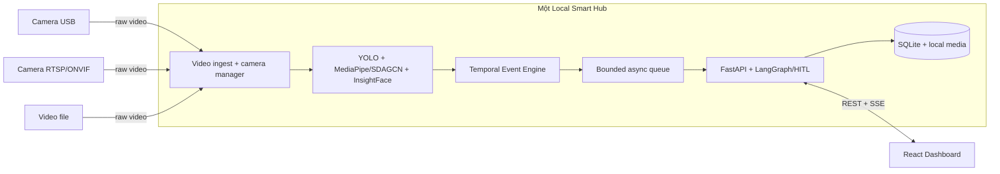

# TÀI LIỆU GATE 1: AN TÂM HOME — GUARDIANCAM LOCAL HUB

> Phiên bản cập nhật theo kiến trúc và mã nguồn hiện tại: nhiều camera thường truyền video về **một Local Smart Hub**; toàn bộ Vision AI, event engine, backend, agent, database và media chạy tập trung trên hub.

---

## 1-PAGE BRIEF

### Tên đề tài

**An Tâm Home — GuardianCam Local Hub: phát hiện té ngã và người lạ trong gia đình bằng AI xử lý cục bộ.**

### Vấn đề

Camera gia đình thông thường chủ yếu ghi hình, buộc người thân phải theo dõi thủ công. Khi người cao tuổi té ngã hoặc người lạ xuất hiện, cảnh báo chậm hoặc báo giả có thể khiến gia đình bỏ lỡ thời điểm xử lý. Giải pháp gửi video liên tục lên cloud còn làm tăng băng thông, chi phí và rủi ro riêng tư trong không gian sống.

### Giải pháp

Một Local Hub trong nhà nhận luồng từ camera USB, RTSP/ONVIF hoặc video file và chạy toàn bộ pipeline:

1. YOLO phát hiện người và tracking.
2. MediaPipe trích xuất keypoint; SDAGCN phân tích chuỗi skeleton để phát hiện té ngã.
3. InsightFace so khớp người thân và phát hiện người lạ.
4. Temporal Event Engine xác nhận theo thời gian, chống trùng và gán mức độ nghiêm trọng.
5. FastAPI lưu sự kiện vào SQLite và phát cảnh báo realtime đến dashboard React.
6. LangGraph hỗ trợ diễn giải và quy trình human-in-the-loop; không thay Vision AI quyết định tín hiệu té ngã.

### Người dùng mục tiêu

- Gia đình có người cao tuổi sống một mình hoặc ở nhà trong thời gian người thân đi làm.
- Người chăm sóc cần xem cảnh báo, lịch sử và xác nhận tình huống từ xa trong LAN/VPN.
- Gia đình ưu tiên xử lý local và không muốn tải video sinh hoạt liên tục lên cloud.

### Giá trị khác biệt

- Camera không cần AI, GPU hoặc edge computer riêng.
- Một hub quản lý tập trung model, dữ liệu, cập nhật và chính sách riêng tư.
- Video thô không được gửi ra cloud theo mặc định.
- Phát hiện và lưu cảnh báo cốt lõi vẫn hoạt động khi mất Internet hoặc LLM không khả dụng.

---

## PRODUCT REQUIREMENTS DOCUMENT (PRD)

### 1. Problem Statement

Người thân không thể quan sát camera liên tục, trong khi motion detection đơn giản tạo nhiều cảnh báo không có ý nghĩa. Bài toán cần phân biệt người quen/người lạ, nhận biết té ngã từ diễn biến theo thời gian và đưa đúng bằng chứng đến người chăm sóc mà vẫn bảo vệ dữ liệu hình ảnh gia đình.

### 2. Product Goals

- Phát hiện sớm tình huống nghi ngờ té ngã hoặc người lạ.
- Giảm cảnh báo trùng và cảnh báo từ một frame đơn lẻ.
- Cung cấp dashboard thống nhất cho camera, alert, history, family và settings.
- Cho phép người dùng xác nhận `safe`, `false_alarm` hoặc `need_help`.
- Lưu event, alert và thao tác review để audit và đánh giá model.
- Chạy local-first trên một máy trung tâm với camera phổ thông.

### 3. Non-goals của MVP

- Không phải thiết bị y tế hoặc hệ thống gọi cấp cứu được chứng nhận.
- Không cam kết loại bỏ hoàn toàn false positive/false negative.
- Không triển khai một thiết bị AI riêng cho từng camera.
- Không hỗ trợ nhiều backend node hoặc high availability trong MVP SQLite.
- Không tự động gửi frame, face embedding hoặc video thô cho LLM/cloud.

### 4. AI Leverage

#### Vision AI quyết định tín hiệu thị giác

- **YOLO:** phát hiện người và vùng quan tâm.
- **MediaPipe:** trích xuất pose/keypoint.
- **SDAGCN:** phân loại hành vi từ chuỗi skeleton 25 khớp thay vì ảnh tĩnh.
- **InsightFace:** tạo và so khớp face embedding để xác định known/unknown.

#### Temporal reasoning giảm nhiễu

Temporal Event Engine dùng nhiều frame, confidence, thời gian bất động, `camera_id` và `track_id` để xác nhận, deduplicate và cooldown. Đây là logic xác định an toàn, không phụ thuộc LLM.

#### Agent hỗ trợ workflow

LangGraph nhận event đã được Vision xác nhận để diễn giải, đề xuất hành động và điều phối human-in-the-loop. Khi LLM lỗi hoặc không có Internet, backend dùng dữ liệu deterministic và vẫn lưu/phát alert.

### 5. MVP Scope

#### Đã có trong repository

- Vision code cho webcam/video: YOLO, MediaPipe, SDAGCN và InsightFace.
- FastAPI nhận `VisionEvent`, chống ghi trùng và lưu SQLite.
- Alert list/detail/review, SSE realtime stream và history.
- Quản lý camera source, người thân, face profile metadata và settings.
- Dashboard React/Vite cho overview, cameras, alerts, history, family và settings.
- Test backend/API, Docker backend và GitHub Actions CI.

#### Cần hoàn thiện để demo end-to-end

- Chuẩn hóa adapter từ `vision/realtime.py` sang `VisionEventRequest`.
- Cung cấp model weights qua artifact/Git LFS kèm checksum.
- Đồng bộ face enrollment filesystem với hồ sơ database.
- Hoàn thiện RTSP reconnect và scheduling nhiều camera.
- Thu thập benchmark trên tập test tách biệt và báo cáo metric thực đo.
- Kiểm tra retention, backup/restore và quyền truy cập media.

### 6. Functional Requirements

| ID | Yêu cầu | Mức ưu tiên |
|---|---|---|
| FR-01 | Hub nhận webcam, video file hoặc RTSP source | Must |
| FR-02 | Phát hiện và tracking người | Must |
| FR-03 | Phân tích té ngã từ chuỗi pose | Must |
| FR-04 | Phân biệt người thân và người lạ | Must |
| FR-05 | Tạo event idempotent theo `event_id` | Must |
| FR-06 | Lưu event/alert và phát realtime qua SSE | Must |
| FR-07 | Người dùng review alert và để lại ghi chú | Must |
| FR-08 | Quản lý camera, người thân và settings | Should |
| FR-09 | Lưu snapshot/clip local theo retention | Should |
| FR-10 | Giám sát health/reconnect nhiều camera | Should |

### 7. Non-functional Requirements

- **Privacy:** video, snapshot và face data ở Local Hub; không commit hoặc gửi cloud mặc định.
- **Resilience:** detection, persistence và alert cơ bản hoạt động offline.
- **Idempotency:** retry cùng `event_id` không tạo alert mới.
- **Security:** không trả RTSP credential cho frontend; `.env` và dữ liệu nhạy cảm không vào Git.
- **Maintainability:** một `requirements.txt`, schema rõ ràng và tài liệu API/architecture đồng bộ.
- **Performance:** sampling/FPS phải cấu hình theo tài nguyên của một hub và số camera.

### 8. Metrics và tiêu chí đánh giá

Các số dưới đây là **mục tiêu Gate/MVP**, chưa được xem là kết quả đạt nếu chưa có báo cáo trong `eval/`.

| Metric | Mục tiêu ban đầu | Cách đo |
|---|---:|---|
| Fall recall | ≥ 95% | Video test tách train, theo từng góc camera |
| Fall precision | ≥ 90% | TP/(TP+FP) trên tập test |
| Unknown-person F1 | ≥ 90% | Tập known/unknown dưới nhiều ánh sáng |
| False alerts | < 1/camera/giờ | Chạy liên tục trong kịch bản sinh hoạt |
| Time-to-alert p95 | < 10 giây | Từ thời điểm event đủ điều kiện đến SSE client |
| Duplicate alerts | 0 với cùng `event_id` | Retry HTTP/event sink test |
| Offline core flow | 100% | Tắt Internet vẫn detect, persist và review được |

Không tối ưu recall bằng cách bỏ qua precision; cả false negative và alert fatigue đều phải được báo cáo.

---

## KIẾN TRÚC MVP



### Quyết định kiến trúc

- Camera chỉ là nguồn video; không chạy model và không có edge node riêng.
- Toàn bộ AI nằm trên một Local Hub để dùng chung GPU/NPU, model và storage.
- Event transport mặc định là bounded queue trong process; không cần MQTT broker cho MVP.
- HTTP `POST /api/v1/vision/events` là adapter khi vision chạy process riêng.
- SQLite phù hợp một hub; nhiều hub/backend worker là bài toán sau MVP.

Sơ đồ đầy đủ: [architecture_diagram.png](architecture_diagram.png).

---

## EVENT CONTRACT

```json
{
  "schema_version": 1,
  "event_id": "living-room-20260806-001",
  "camera_id": "living-room",
  "camera_location": "Phòng khách",
  "event_type": "FALL_CONFIRMED",
  "occurred_at": "2026-08-06T10:20:31+07:00",
  "confidence": 0.93,
  "track_id": "37",
  "identity_status": "KNOWN",
  "identity_name": "Nguyễn Văn An",
  "snapshot_path": "snapshots/event-001.jpg",
  "immobile_seconds": 8.2,
  "metadata": {"vision_version": "sdagcn-v1"}
}
```

Event type hỗ trợ: `FALL_SUSPECTED`, `FALL_CONFIRMED`, `UNKNOWN_PERSON`, `PERSON_RECOGNIZED`, `INACTIVITY_DETECTED`, `CAMERA_OFFLINE`, `CAMERA_ONLINE`.

---

## WIREFRAME & UI FLOW

### 1. Overview

- Hiển thị số camera online/offline, cảnh báo chưa đọc và trạng thái hệ thống.
- Điều hướng nhanh tới camera hoặc alert cần xử lý.

### 2. Cameras

- Danh sách camera, vị trí, trạng thái và playback an toàn.
- Cấu hình `video_file`, `webcam` hoặc `rtsp` mà không lộ `source_uri` credential.

### 3. Alerts và Human-in-the-loop

- Danh sách cảnh báo realtime qua SSE.
- Chi tiết loại event, camera, confidence, người nhận diện và snapshot.
- Review theo trạng thái `checking`, `safe`, `false_alarm`, `need_help` hoặc `resolved`.
- Ghi chú review được lưu vào audit trail.

### 4. History

- Tra cứu sự kiện đã lưu và kết quả xử lý.
- Dùng dữ liệu review làm bằng chứng đánh giá model, không tự động retrain trong MVP.

### 5. Family

- Quản lý hồ sơ người thân và face profile metadata.
- Face image/embedding thật chỉ lưu local, không vào Git.

### 6. Settings

- Ngưỡng fall/unknown person, cấu hình notification, người dùng và camera.
- Các quyền production cần được hoàn thiện trước khi mở truy cập ngoài LAN.

---

## GITHUB REPOSITORY SETUP

```text
P-227/
├── src/                     # FastAPI, LangGraph, API, services, schemas
├── vision/                  # YOLO, pose, SDAGCN, InsightFace, realtime
├── frontend/                # React/Vite dashboard
├── database/                # SQLite schema, seed và query tham khảo
├── tests/                   # Agent, service và API tests
├── docs/                    # Tài liệu kỹ thuật và Gate deliverables
├── eval/                    # Metric/bằng chứng đánh giá
├── presentation/            # Demo và pitch materials
├── scripts/                 # Setup và AI logging hooks
├── requirements.txt         # Dependency Python hợp nhất
├── Dockerfile
├── docker-compose.yml
└── README.md
```

Model `.pt`, database, face data, `.env`, TensorBoard runs và training artifacts bị Git ignore. Model triển khai phải được phân phối riêng và có checksum.

---

## RỦI RO VÀ GIẢM THIỂU

| Rủi ro | Tác động | Giảm thiểu |
|---|---|---|
| Ngã bị che khuất/góc camera xấu | Bỏ sót | Nhiều góc test, temporal window, hướng dẫn lắp camera |
| Người ngồi/nằm bị báo ngã | Alert fatigue | Time-series, immobility, HITL feedback |
| Ánh sáng yếu làm sai face | Báo người lạ | Threshold `UNCERTAIN`, nhiều ảnh enrollment, không ép match |
| Hub quá tải khi nhiều camera | Tăng latency | Sampling, resolution limit, bounded queue, health metric |
| Mất điện/hỏng hub | Mất giám sát | UPS, watchdog, backup và cảnh báo camera/hub offline |
| Lộ face/snapshot | Vi phạm riêng tư | Local storage, encryption, retention, access control |
| LLM không khả dụng | Mất diễn giải | Deterministic fallback; không phụ thuộc LLM cho detection |

---

## ACCEPTANCE CRITERIA CHO MVP DEMO

- [ ] Một video/webcam té ngã tạo `FALL_CONFIRMED` và alert xuất hiện trên dashboard.
- [ ] Một người chưa đăng ký tạo `UNKNOWN_PERSON`.
- [ ] Gửi lại cùng `event_id` không tạo alert trùng.
- [ ] Người dùng review alert và xem lại được trong history.
- [ ] Restart backend không làm mất event/alert đã lưu.
- [ ] Tắt Internet vẫn chạy được detection, SQLite và dashboard trong LAN.
- [ ] Không có `.env`, model weight, face image hoặc database trong Git diff.
- [ ] Báo cáo metric thực đo được lưu trong `eval/` và không trình bày mục tiêu như kết quả.

---

## TÀI LIỆU LIÊN QUAN

- [README dự án](../README.md)
- [Kiến trúc chi tiết](architecture.md)
- [Vision AI](vision.md)
- [API contract](api.md)
- [Database](database.md)
- [Bảo mật](security.md)
- [Roadmap](roadmap.md)
