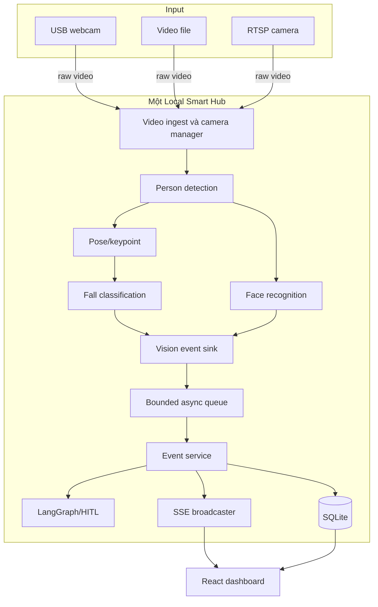

# Kiến trúc hệ thống

## Nguyên tắc

- Video thô được xử lý trên Local Hub.
- Vision quyết định tín hiệu thị giác; LLM không xác định một người có ngã hay không.
- Backend sở hữu persistence, API, audit và human-in-the-loop.
- Hệ thống an toàn cốt lõi tiếp tục hoạt động khi mất Internet.

## Thành phần

Camera chỉ cung cấp video. Không camera nào cần GPU, model hoặc một edge computer riêng; toàn bộ khối trong `Một Local Smart Hub` chạy trên cùng máy trung tâm.

## Ranh giới trách nhiệm

| Thành phần | Trách nhiệm |
|---|---|
| Vision | Frame, tracking, pose, face, confidence và event ban đầu |
| Event sink | Validate contract, queue và chống duplicate theo `event_id` |
| Event service | Lưu event/alert, severity, broadcast và review |
| LangGraph | Diễn giải, đề xuất workflow và human validation |
| SQLite | Sự kiện, người, camera, cảnh báo, settings và audit |
| React | Dashboard, camera, lịch sử, gia đình và xử lý cảnh báo |

## Luồng cảnh báo

1. Camera cung cấp frame cho vision.
2. Vision phát hiện `FALL_SUSPECTED`, `FALL_CONFIRMED` hoặc `UNKNOWN_PERSON`.
3. Event được gửi đến `POST /api/v1/vision/events` hoặc publish trực tiếp vào sink khi chạy cùng process.
4. Backend lưu event và tạo/cập nhật alert.
5. Dashboard nhận alert mới qua SSE.
6. Người dùng đánh dấu an toàn, báo nhầm hoặc yêu cầu hỗ trợ.
7. Mọi thay đổi được lưu để audit và đánh giá model.

## Khả năng mở rộng

MVP dùng SQLite và queue trong process. Khi triển khai nhiều hub hoặc nhiều backend worker, cần thay queue bằng broker bền vững, chuyển persistence sang PostgreSQL và đưa media qua object storage/gateway nội bộ.
