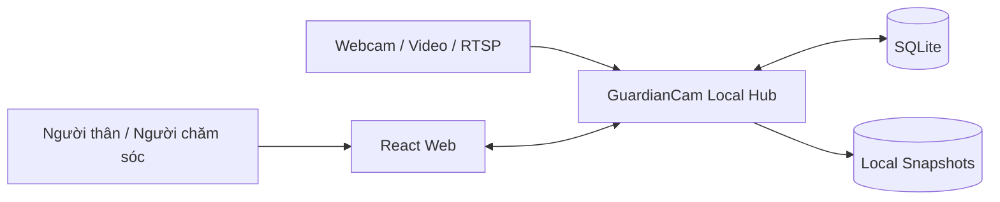
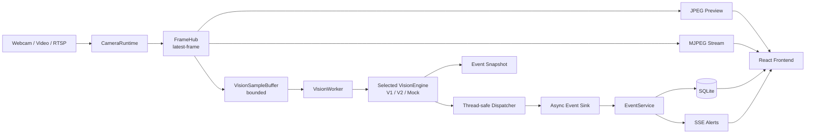
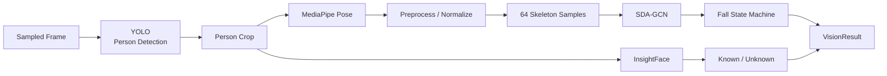
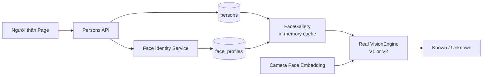
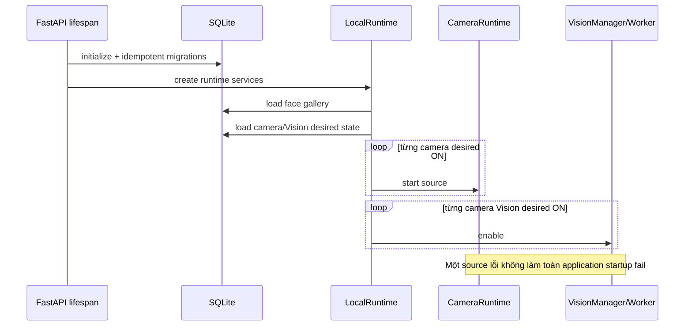
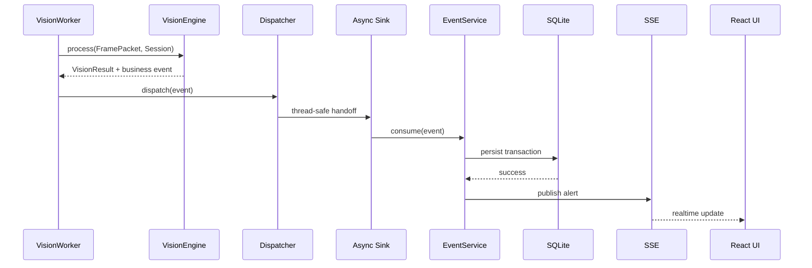
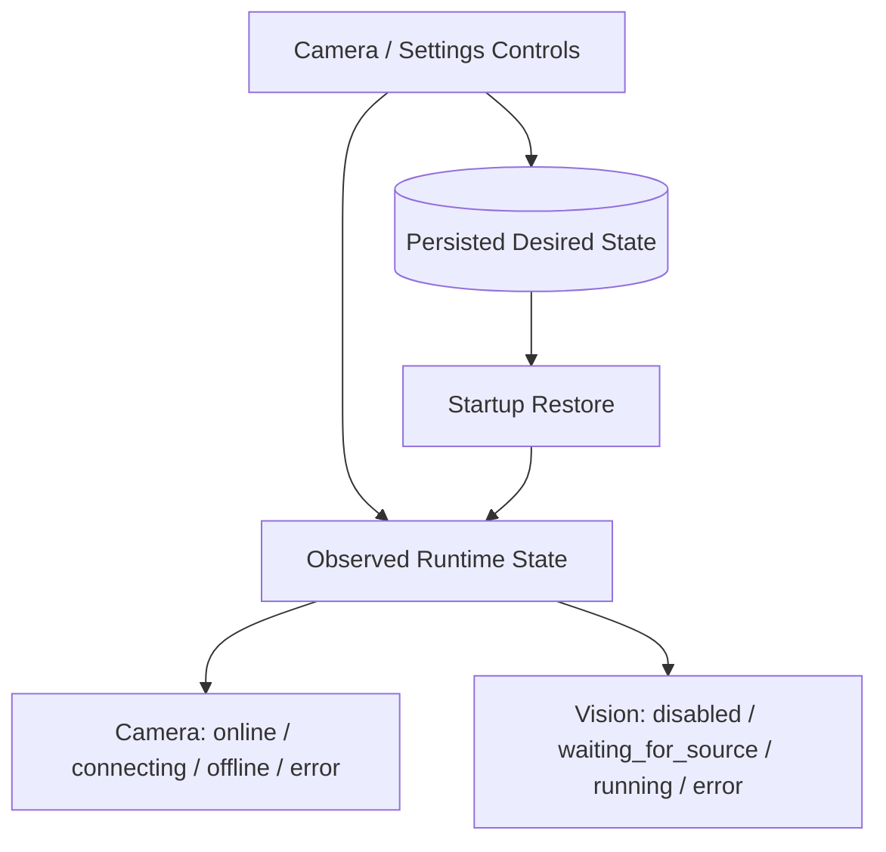
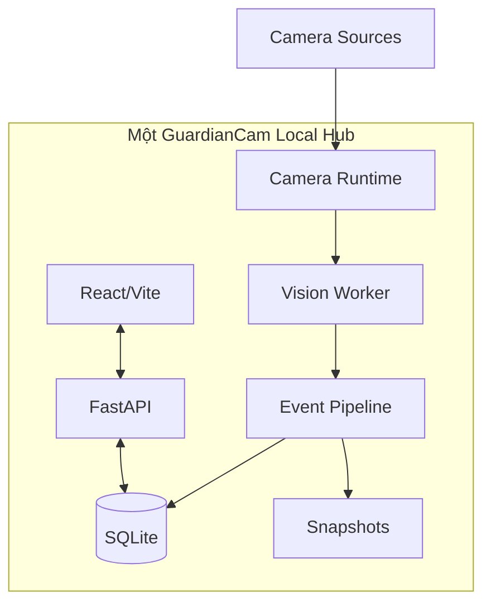

# GuardianCam — Architecture Diagrams

Tài liệu này chỉ chứa các sơ đồ kiến trúc chính để dùng khi review, trình bày hoặc làm deliverable. Giải thích chi tiết nằm trong [architecture.md](architecture.md).

## 1. System context

## 2. Runtime architecture

## 3. Vision pipeline

## 4. Identity data flow

**Production source of truth:** `persons` + `face_profiles` trong SQLite. Thư mục `register face/` không phải nguồn dữ liệu production.

## 5. Startup restore

## 6. Event flow

## 7. Desired state vs observed state

Một camera desired ON có thể tạm `offline/error`; điều đó không được tự đổi persisted desired state thành OFF.

## 8. Deployment boundary

Runtime không yêu cầu Redis, Kafka, Celery hoặc một AI service riêng cho từng camera.
