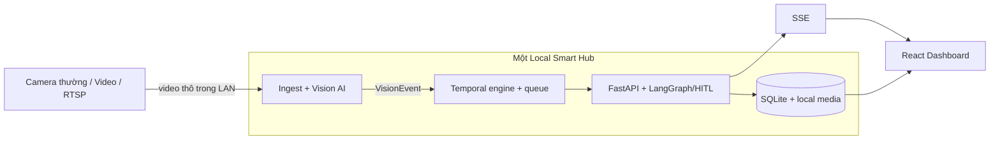

# Architecture Diagram

Tài liệu chuẩn của kiến trúc nằm tại [architecture.md](architecture.md). File này giữ sơ đồ rút gọn để tương thích checklist deliverable.

Ảnh xuất tĩnh dành cho slide: [architecture_diagram.png](architecture_diagram.png). Bản nguồn chỉnh sửa được lưu tại [architecture_diagram.svg](architecture_diagram.svg).

Các nguyên tắc chính:

- Vision và dữ liệu nhạy cảm chạy local.
- Camera không chạy AI và không có edge computer riêng.
- Event JSON không chứa video thô hoặc embedding khuôn mặt.
- LangGraph xử lý workflow sau khi vision đã tạo tín hiệu.
- SQLite phù hợp một Local Hub; kiến trúc nhiều node cần broker và PostgreSQL.
