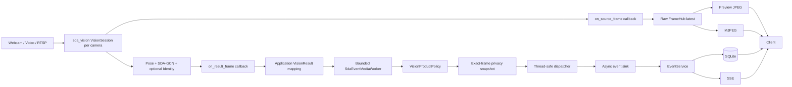
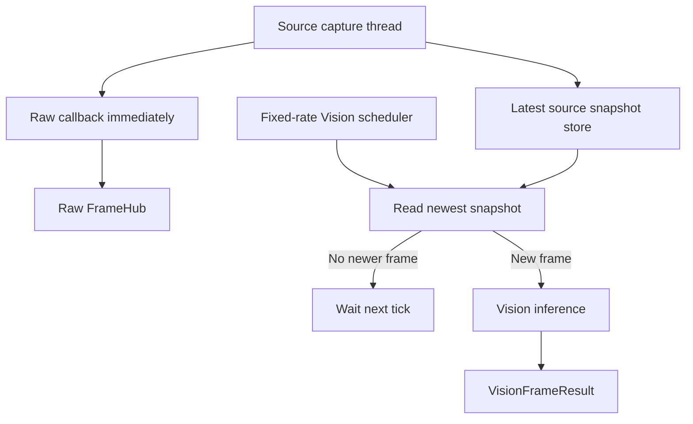
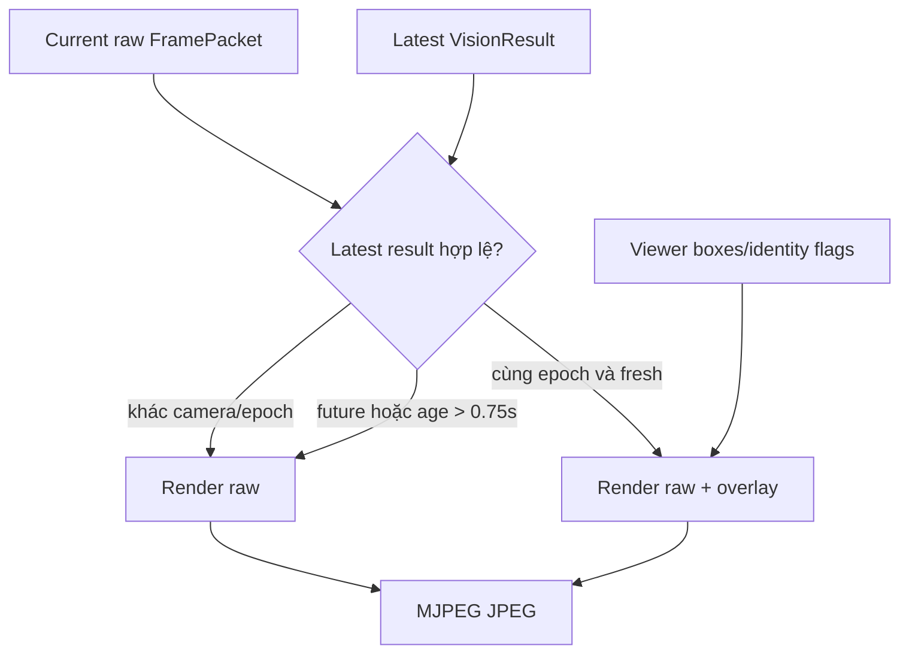
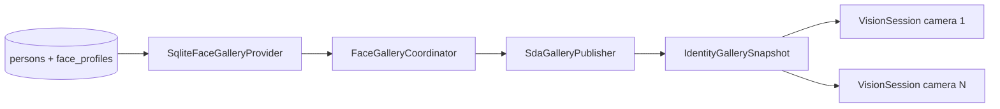
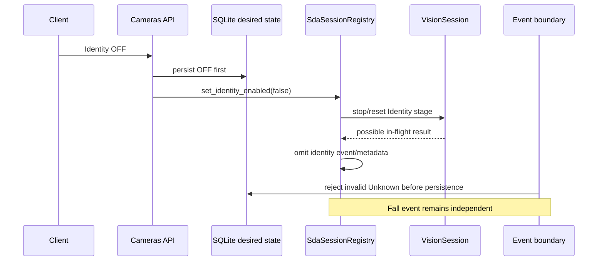
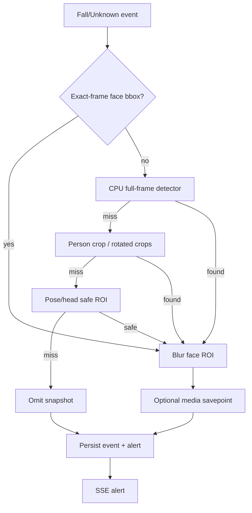
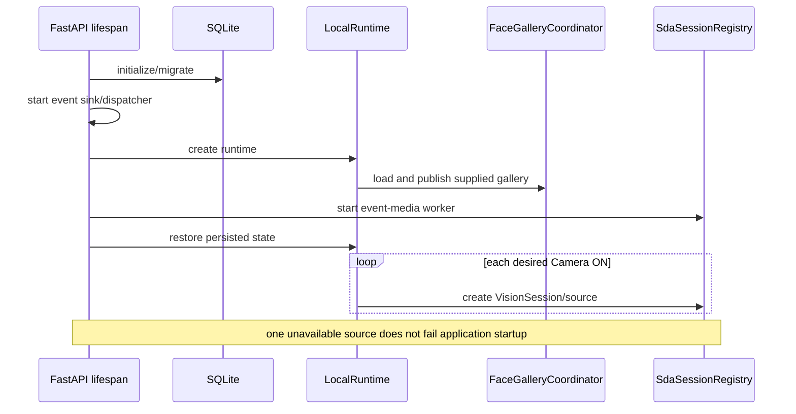

# GuardianCam — Architecture Diagrams

Các sơ đồ dưới đây phản ánh production runtime dùng `sda_vision` hiện tại.

## 1. Runtime

## 2. Session scheduling

Capture không chờ inference. Scheduler lấy snapshot mới nhất nên không tạo
queue frame vô hạn khi Vision chậm.

## 3. Stream overlay

## 4. Identity gallery

Integrated mode chỉ dùng supplied gallery từ SQLite. Filesystem/NPZ chỉ dành
cho SDA CLI standalone.

## 5. Identity OFF race protection

## 6. Snapshot privacy và optional media

## 7. Startup restore

