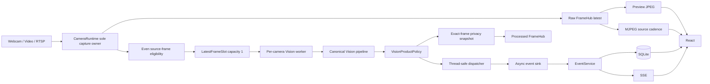
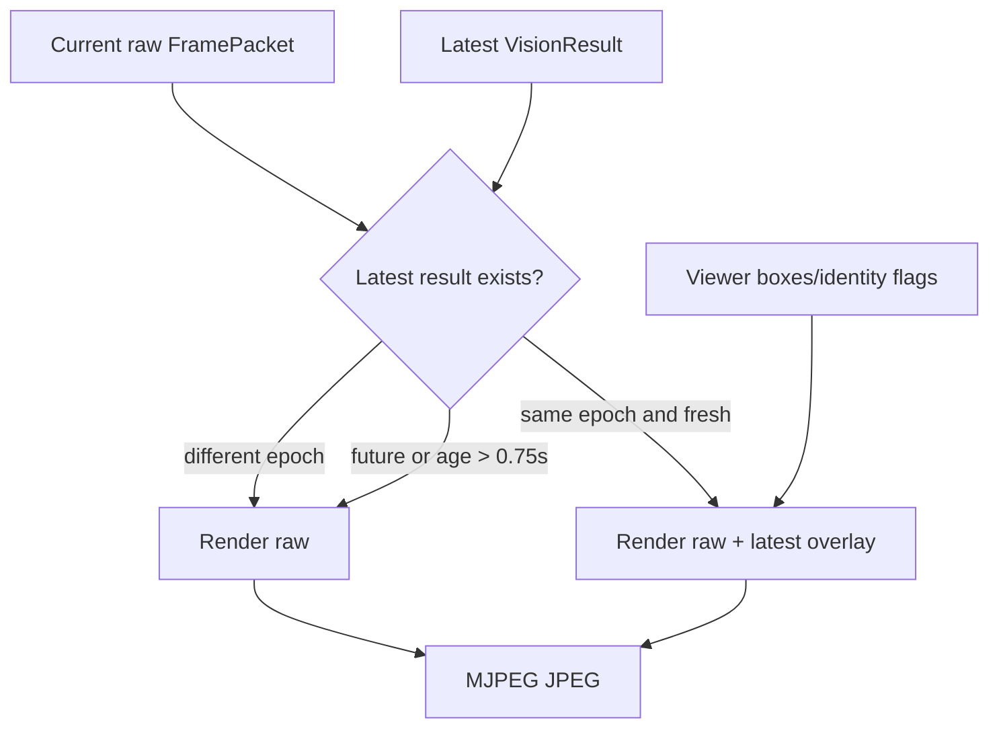
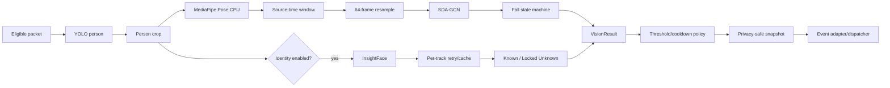
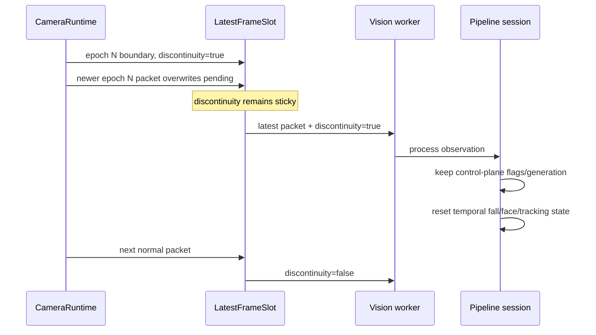
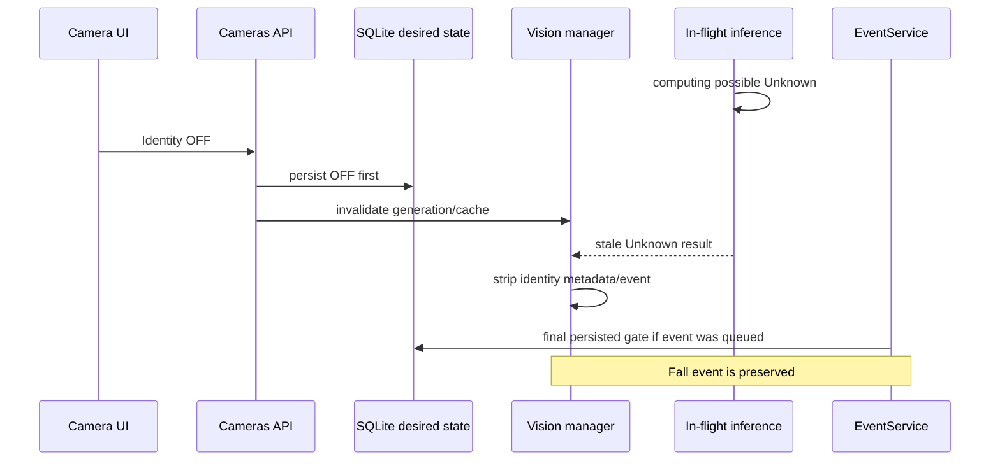
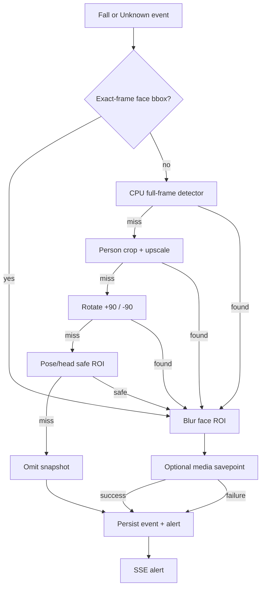
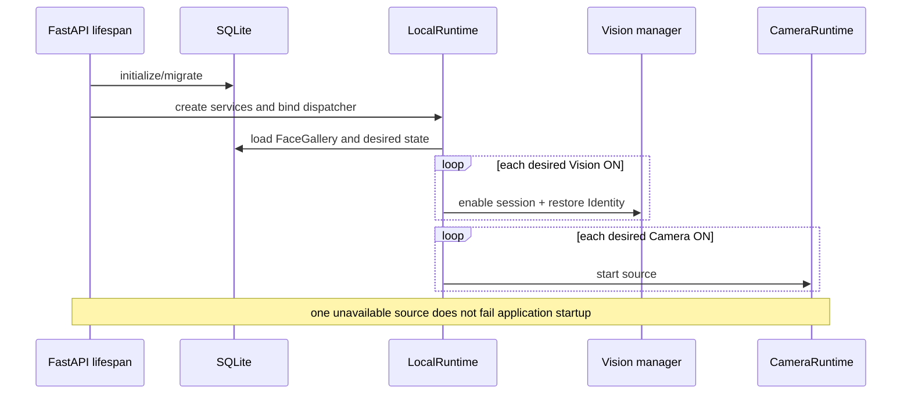

# GuardianCam — Architecture Diagrams

Các sơ đồ dưới đây phản ánh production runtime hiện tại.

## 1. Runtime

## 2. Stream overlay

## 3. Vision and events

## 4. Source discontinuity

## 5. Identity OFF race protection

## 6. Snapshot privacy and optional media

## 7. Startup restore

