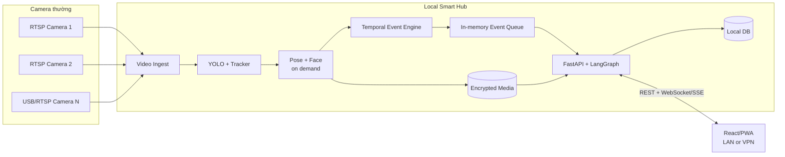

# Sơ đồ kiến trúc GuardianCam — Central Local Hub

Video thô chỉ đi từ camera đến Local Hub trong mạng nội bộ. Vision truyền event object qua bounded queue; snapshot và clip nằm trên shared local volume. Event Engine quyết định cảnh báo an toàn trước khi phần diễn giải tùy chọn hoạt động.

Chi tiết contract, trách nhiệm thành phần và ràng buộc bảo mật nằm tại [`../ARCHITECTURE.md`](../ARCHITECTURE.md).
