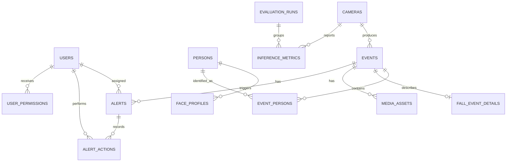

# Thiết kế database SQLite cho Camera AI

## Phạm vi

Database phục vụ bản demo Camera AI chạy hoàn toàn trên một laptop. Nguồn hình là webcam hoặc MP4 mô phỏng; AI có thể ghi nhận người quen, người chưa xác định và khả năng té ngã. Thiết kế này chỉ bao gồm SQLite, không bao gồm API, giao diện, xác thực, MQTT, Docker hay triển khai mô hình AI.

SQLite chỉ lưu metadata, face embedding đã mã hóa và đường dẫn tương đối tới snapshot. Database không lưu video thô, ảnh dưới dạng BLOB hoặc khuôn mặt thô của người lạ.

## Kiến trúc dữ liệu

- Danh mục và phân quyền: `users`, `user_permissions`, `persons`, `cameras`.
- Sinh trắc học người quen: `face_profiles`.
- Kết quả AI ban đầu: `events`, `event_persons`, `fall_event_details`.
- Media và quy trình cảnh báo: `media_assets`, `alerts`, `alert_actions`.
- Đo lường: `inference_metrics`, `evaluation_runs`.

Kết quả AI ban đầu là bất biến. Nhận xét hoặc xác nhận của người dùng được thêm vào `alert_actions`, không sửa `ai_confidence`, loại sự kiện hay kết quả nhận diện. `alerts.status` là trạng thái hiện hành để truy vấn nhanh, còn `alert_actions` là lịch sử append-only.

Người lạ không được tạo trong `persons` và không có `face_profiles`. Một track người lạ có `event_persons.identity_type = 'unknown'` và `person_id IS NULL`.

## ERD

## Data dictionary

Mọi ID là UUID lưu bằng `TEXT`. Mọi timestamp là UTC ISO 8601 `TEXT`, khuyến nghị `YYYY-MM-DDTHH:MM:SS.sssZ`. Boolean là `INTEGER` giới hạn ở `0/1`. Enum là `TEXT` với `CHECK`. Những cột thời gian không ghi default phải được caller cung cấp vì chúng biểu diễn thời điểm nghiệp vụ, không phải thời điểm insert.

### `users`

Tài khoản nghiệp vụ; không chứa credential hay logic authentication.

| Cột | Kiểu | Null | Default | Key/constraint |
|---|---|---:|---|---|
| `id` | TEXT | Không | — | PK, UUID 36 ký tự |
| `email` | TEXT | Không | — | Unique không phân biệt hoa/thường, không rỗng |
| `display_name` | TEXT | Không | — | Không rỗng |
| `role` | TEXT | Không | — | `admin`, `caregiver` |
| `is_active` | INTEGER | Không | `1` | Boolean |
| `created_at` | TEXT | Không | UTC hiện tại | |
| `updated_at` | TEXT | Không | UTC hiện tại | |

Xóa: ưu tiên vô hiệu hóa. FK từ alert và action dùng `SET NULL` để giữ audit.

### `user_permissions`

Quyền chi tiết của caregiver. Admin có toàn quyền ngầm định và không cần bản ghi trong bảng này.

| Cột | Kiểu | Null | Default | Key/constraint |
|---|---|---:|---|---|
| `id` | TEXT | Không | — | PK, UUID 36 ký tự |
| `user_id` | TEXT | Không | — | FK → `users.id`, cascade |
| `permission_key` | TEXT | Không | — | Một trong 6 quyền được hỗ trợ |
| `is_granted` | INTEGER | Không | `0` | Boolean |
| `updated_at` | TEXT | Không | UTC hiện tại | Thời điểm thay đổi gần nhất |

Unique `(user_id, permission_key)`. Các quyền hợp lệ gồm `view_history`, `acknowledge_alert`, `resolve_alert`, `manage_cameras`, `manage_persons`, `manage_users`.

Trigger `trg_default_permissions_on_caregiver_insert` tự tạo 6 dòng khi thêm caregiver. `view_history` và `acknowledge_alert` mặc định bật; bốn quyền còn lại mặc định tắt. Xóa user cascade toàn bộ quyền. Backend phải trả về cho admin trước khi truy vấn bảng này.

### `persons`

Người thân/người quen đã đăng ký. Không tạo record cho người lạ.

| Cột | Kiểu | Null | Default | Key/constraint |
|---|---|---:|---|---|
| `id` | TEXT | Không | — | PK |
| `display_name` | TEXT | Không | — | Không rỗng |
| `relationship_label` | TEXT | Có | `NULL` | |
| `date_of_birth` | TEXT | Có | `NULL` | Dạng `YYYY-MM-DD` |
| `notes` | TEXT | Có | `NULL` | |
| `is_active` | INTEGER | Không | `1` | Boolean |
| `created_at` | TEXT | Không | UTC hiện tại | |
| `updated_at` | TEXT | Không | UTC hiện tại | |

Xóa: `face_profiles` cascade; lịch sử `event_persons` dùng `RESTRICT`. Thông thường khóa mềm bằng `is_active`.

### `face_profiles`

Embedding đã mã hóa của người quen. Một người có thể có nhiều profile theo góc mặt hoặc phiên bản model.

| Cột | Kiểu | Null | Default | Key/constraint |
|---|---|---:|---|---|
| `id` | TEXT | Không | — | PK |
| `person_id` | TEXT | Không | — | FK → `persons.id`, cascade |
| `model_name` | TEXT | Không | — | Không rỗng |
| `model_version` | TEXT | Không | — | Không rỗng |
| `embedding` | BLOB | Không | — | BLOB không rỗng, phải được mã hóa |
| `embedding_dimension` | INTEGER | Không | — | `> 0` |
| `quality_score` | REAL | Có | `NULL` | `[0,1]` |
| `is_active` | INTEGER | Không | `1` | Boolean |
| `created_at` | TEXT | Không | UTC hiện tại | |

### `cameras`

Cấu hình webcam hoặc file MP4 mô phỏng.

| Cột | Kiểu | Null | Default | Key/constraint |
|---|---|---:|---|---|
| `id` | TEXT | Không | — | PK |
| `name` | TEXT | Không | — | Unique, không rỗng |
| `source_type` | TEXT | Không | — | `webcam`, `video_file` |
| `source_reference` | TEXT | Không | — | Device index hoặc relative path |
| `location_label` | TEXT | Không | — | Không rỗng |
| `operational_status` | TEXT | Không | `offline` | `online`, `offline`, `error` |
| `last_seen_at` | TEXT | Có | `NULL` | Heartbeat gần nhất |
| `is_active` | INTEGER | Không | `1` | Boolean |
| `created_at` | TEXT | Không | UTC hiện tại | |
| `updated_at` | TEXT | Không | UTC hiện tại | |

Với `video_file`, đường dẫn tuyệt đối, `file://` và segment `..` bị cấm. Xóa camera bị `RESTRICT` khi đã có event/metric; dùng `is_active = 0`.

### `events`

Kết quả AI ban đầu ở cấp sự kiện.

| Cột | Kiểu | Null | Default | Key/constraint |
|---|---|---:|---|---|
| `id` | TEXT | Không | — | PK |
| `camera_id` | TEXT | Không | — | FK → `cameras.id`, restrict |
| `event_type` | TEXT | Không | — | `person_detected`, `fall_suspected` |
| `occurred_at` | TEXT | Không | — | UTC |
| `ended_at` | TEXT | Có | `NULL` | `>= occurred_at` |
| `ai_model_name` | TEXT | Không | — | Không rỗng |
| `ai_model_version` | TEXT | Không | — | Không rỗng |
| `ai_confidence` | REAL | Có | `NULL` | `[0,1]` |
| `metadata_json` | TEXT | Có | `NULL` | Không chứa embedding/base64 ảnh |
| `created_at` | TEXT | Không | UTC hiện tại | |

Các trường AI bị trigger chặn update. Chỉ `ended_at` có thể được bổ sung khi event kết thúc. Purge event cascade tới dữ liệu con.

### `event_persons`

Mỗi record là một track người trong event và là nguồn cho truy vấn lần xuất hiện.

| Cột | Kiểu | Null | Default | Key/constraint |
|---|---|---:|---|---|
| `id` | TEXT | Không | — | PK |
| `event_id` | TEXT | Không | — | FK → `events.id`, cascade |
| `person_id` | TEXT | Có | `NULL` | FK → `persons.id`, restrict |
| `track_id` | TEXT | Không | — | Unique cùng `event_id` |
| `identity_type` | TEXT | Không | — | `known`, `unknown` |
| `ai_confidence` | REAL | Có | `NULL` | `[0,1]` |
| `first_seen_at` | TEXT | Không | — | UTC |
| `last_seen_at` | TEXT | Không | — | `>= first_seen_at` |
| `bounding_box_json` | TEXT | Có | `NULL` | Metadata hình học |

`known` yêu cầu `person_id`; `unknown` yêu cầu `person_id IS NULL`. Record bất biến sau insert.

### `fall_event_details`

Subtype 0..1 cho event nghi té ngã.

| Cột | Kiểu | Null | Default | Key/constraint |
|---|---|---:|---|---|
| `id` | TEXT | Không | — | PK |
| `event_id` | TEXT | Không | — | FK unique → `events.id`, cascade |
| `posture` | TEXT | Không | `unknown` | `standing`, `sitting`, `lying`, `transitioning`, `unknown` |
| `fall_confidence` | REAL | Không | — | `[0,1]` |
| `immobility_duration_ms` | INTEGER | Có | `NULL` | `>= 0` |
| `bounding_box_json` | TEXT | Có | `NULL` | |
| `algorithm_details_json` | TEXT | Có | `NULL` | Không chứa dữ liệu nhạy cảm |

Trigger chỉ cho phép gắn với `fall_suspected`; record bất biến.

### `media_assets`

Metadata snapshot; không lưu byte ảnh/video.

| Cột | Kiểu | Null | Default | Key/constraint |
|---|---|---:|---|---|
| `id` | TEXT | Không | — | PK |
| `event_id` | TEXT | Không | — | FK → `events.id`, cascade |
| `media_type` | TEXT | Không | `snapshot` | Chỉ `snapshot` |
| `subject_type` | TEXT | Không | — | `known_person`, `unknown_person`, `fall`, `scene` |
| `relative_path` | TEXT | Không | — | Unique, relative, không traversal |
| `mime_type` | TEXT | Không | — | JPEG, PNG, WebP |
| `is_blurred` | INTEGER | Không | `0` | Boolean; người lạ bắt buộc `1` |
| `captured_at` | TEXT | Không | — | UTC |
| `retention_until` | TEXT | Không | — | `>= captured_at` |
| `sha256` | TEXT | Có | `NULL` | Unique, đúng 64 ký tự |
| `created_at` | TEXT | Không | UTC hiện tại | |

### `alerts`

Trạng thái cảnh báo hiện hành; không phải nhãn AI hay verdict con người.

| Cột | Kiểu | Null | Default | Key/constraint |
|---|---|---:|---|---|
| `id` | TEXT | Không | — | PK |
| `event_id` | TEXT | Không | — | FK → `events.id`, cascade |
| `alert_type` | TEXT | Không | — | `unknown_person`, `fall` |
| `severity` | TEXT | Không | `medium` | `low`, `medium`, `high`, `critical` |
| `status` | TEXT | Không | `open` | `open`, `acknowledged`, `resolved`, `dismissed` |
| `assigned_user_id` | TEXT | Có | `NULL` | FK → `users.id`, set null |
| `created_at` | TEXT | Không | UTC hiện tại | |
| `updated_at` | TEXT | Không | UTC hiện tại | |
| `acknowledged_at` | TEXT | Có | `NULL` | Không trước `created_at` |
| `resolved_at` | TEXT | Có | `NULL` | Không trước `created_at` |

Unique `(event_id, alert_type)`. Trigger kiểm tra alert té ngã/người lạ đúng với dữ liệu event.

### `alert_actions`

Audit log append-only cho mọi thao tác và verdict.

| Cột | Kiểu | Null | Default | Key/constraint |
|---|---|---:|---|---|
| `id` | TEXT | Không | — | PK |
| `alert_id` | TEXT | Không | — | FK → `alerts.id`, cascade |
| `user_id` | TEXT | Có | `NULL` | FK → `users.id`, set null |
| `action_type` | TEXT | Không | — | Enum hành động |
| `previous_status` | TEXT | Có | `NULL` | Enum status |
| `new_status` | TEXT | Có | `NULL` | Enum status |
| `human_verdict` | TEXT | Có | `NULL` | `true_positive`, `false_positive`, `uncertain` |
| `note` | TEXT | Có | `NULL` | |
| `created_at` | TEXT | Không | UTC hiện tại | |

Hành động: `created`, `acknowledged`, `assigned`, `commented`, `resolved`, `dismissed`, `reopened`, `verdict_recorded`. Chỉ `verdict_recorded` được mang `human_verdict`. Trigger cấm update/delete.

### `evaluation_runs`

Nhóm metric chất lượng của một lần đánh giá.

| Cột | Kiểu | Null | Default | Key/constraint |
|---|---|---:|---|---|
| `id` | TEXT | Không | — | PK |
| `name` | TEXT | Không | — | Không rỗng |
| `model_name` | TEXT | Không | — | Không rỗng |
| `model_version` | TEXT | Không | — | Không rỗng |
| `status` | TEXT | Không | `pending` | `pending`, `running`, `completed`, `failed`, `cancelled` |
| `started_at` | TEXT | Có | `NULL` | UTC |
| `completed_at` | TEXT | Có | `NULL` | Không trước `started_at` |
| `notes` | TEXT | Có | `NULL` | |
| `created_at` | TEXT | Không | UTC hiện tại | |

### `inference_metrics`

Metric vận hành theo camera và metric chất lượng tùy chọn theo evaluation run.

| Cột | Kiểu | Null | Default | Key/constraint |
|---|---|---:|---|---|
| `id` | TEXT | Không | — | PK |
| `camera_id` | TEXT | Không | — | FK → `cameras.id`, restrict |
| `evaluation_run_id` | TEXT | Có | `NULL` | FK → `evaluation_runs.id`, set null |
| `measured_at` | TEXT | Không | — | UTC |
| `window_started_at` | TEXT | Có | `NULL` | UTC |
| `window_ended_at` | TEXT | Có | `NULL` | Không trước thời điểm đầu |
| `fps` | REAL | Có | `NULL` | `>= 0` |
| `latency_ms` | REAL | Có | `NULL` | `>= 0` |
| `precision_score` | REAL | Có | `NULL` | `[0,1]` |
| `recall_score` | REAL | Có | `NULL` | `[0,1]` |
| `false_positive_rate` | REAL | Có | `NULL` | `[0,1]` |
| `sample_count` | INTEGER | Có | `NULL` | `>= 0` |

Ít nhất một metric phải có giá trị.

## Index và mục đích

| Index | Mục đích |
|---|---|
| `uq_users_email_nocase` | Email unique không phân biệt hoa/thường |
| `idx_user_permissions_user` | Tải nhanh toàn bộ quyền của caregiver |
| `idx_face_profiles_person_active` | Embedding đang hoạt động của một người |
| `idx_cameras_status_last_seen` | Camera offline/heartbeat cũ |
| `idx_events_camera_occurred` | Timeline theo camera |
| `idx_events_type_occurred` | Đếm/lọc event theo loại và thời gian |
| `idx_event_persons_person_last_seen` | Người/camera nhìn thấy gần nhất |
| `idx_event_persons_identity_first_seen` | Người lạ trong khoảng thời gian |
| `idx_event_persons_event` | Join các track của event |
| `idx_media_assets_event` | Snapshot của event |
| `idx_media_assets_retention` | Dọn snapshot hết hạn |
| `idx_alerts_status_created` | Alert theo trạng thái |
| `idx_alerts_open_created` | Alert chưa xác nhận |
| `idx_alerts_type_created` | Đếm alert té ngã |
| `idx_alert_actions_alert_created` | Lịch sử xử lý alert |
| `idx_alert_actions_verdict_created` | Tính false-alert rate |
| `idx_metrics_camera_measured` | FPS/latency mới nhất mỗi camera |
| `idx_metrics_evaluation_run` | Metric của một lần đánh giá |

## Quy tắc bảo mật và retention

1. Bật `PRAGMA foreign_keys = ON` trên mọi connection.
2. Không lưu video thô hoặc video archive trong database.
3. Không lưu byte ảnh trong SQLite; chỉ dùng relative path.
4. Không cho phép absolute path, URI `file://` hoặc traversal `..`.
5. Không tạo face profile hoặc lưu khuôn mặt thô của người lạ.
6. Snapshot người lạ chỉ được insert sau khi làm mờ thành công.
7. Face embedding phải được mã hóa bên ngoài SQLite; khóa mã hóa không nằm trong DB.
8. Không ghi embedding vào log, exception, telemetry hoặc response.
9. JSON metadata không được chứa embedding hoặc ảnh base64.
10. `retention_until` bắt buộc. Cleanup xóa file trước, sau đó xóa metadata trong DB.
11. Event metadata có thể được giữ lâu hơn snapshot phục vụ thống kê.
12. Thay đổi alert và insert `alert_actions` phải nằm trong cùng transaction.
13. Verdict hiện hành là `human_verdict` mới nhất, không phải giá trị ghi đè vào event.

## File đi kèm

- `database/schema.sql`: DDL, index và trigger hoàn chỉnh.
- `database/seed.sql`: dữ liệu kiểm thử tối thiểu, không chứa sinh trắc học thật.
- `database/queries.sql`: truy vấn quan trọng dùng named parameters.
