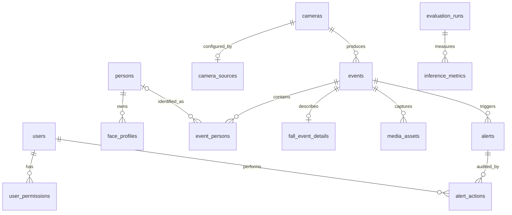

# Thiết kế database chi tiết

Xem hướng dẫn vận hành tại [database.md](database.md). Tài liệu này tập trung vào quan hệ dữ liệu.

## ER diagram

## Identity và quyền

- `users`: tài khoản vận hành dashboard.
- `user_permissions`: quyền chi tiết theo user.
- `persons`: người thân được quản lý.
- `face_profiles`: metadata/embedding reference cho nhận diện.

User vận hành và person được camera nhận diện là hai thực thể khác nhau.

## Camera

- `cameras` chứa danh tính, vị trí và trạng thái.
- `camera_sources` chứa loại nguồn, URI nội bộ và playback path an toàn.

Không trả `source_uri` cho frontend vì RTSP URI có thể chứa username/password.

## Event và nhận diện

- `events` là bản ghi bất biến tương đối của tín hiệu vision.
- `event_persons` nối event với track và person nếu nhận diện được.
- `fall_event_details` chỉ có với event té ngã.
- `media_assets` tham chiếu snapshot/clip local; không lưu binary trong SQLite.

`event_id` từ vision phải duy nhất để bảo đảm idempotency khi retry HTTP hoặc reconnect.

## Alerts và HITL

- Một event có thể tạo alert tùy loại/severity.
- `alerts` chứa trạng thái hiện tại để truy vấn nhanh.
- `alert_actions` là lịch sử append-only của thao tác xác nhận, báo nhầm hoặc yêu cầu trợ giúp.

Không suy ra audit history chỉ từ trạng thái hiện tại của alert.

## Settings và evaluation

- `system_settings` lưu JSON hợp lệ cho general/notification policies.
- `evaluation_runs` định danh một lần benchmark.
- `inference_metrics` lưu metric theo model/camera/dataset.

## Constraints quan trọng

- Foreign key phải được bật cho từng SQLite connection.
- Confidence nằm trong miền hợp lệ theo schema.
- Enum/status được giới hạn bằng CHECK constraint.
- Relative media path được dùng thay vì absolute path phụ thuộc host.
- Thời gian lưu dạng ISO-8601 UTC; frontend chuyển timezone khi hiển thị.

## Migration

`src/database.py` hiện có migration runtime nhỏ và idempotent. Khi schema phát triển mạnh hơn, chuyển sang migration có version (ví dụ Alembic) trước khi hỗ trợ PostgreSQL hoặc nhiều môi trường production.
