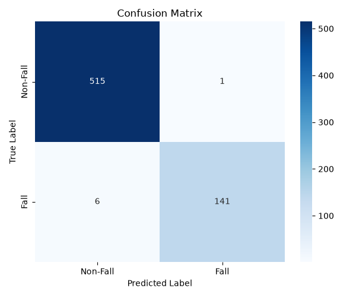

# Model Evaluation Metrics

## Các bộ dữ liệu dùng để đánh giá 
1. Fall Vision: A Benchmark Video Dataset for Advancing Fall Detection Technology, Harvard Dataverse, V2.
2. Multiple cameras fall dataset. This dataset contain 24 scenarios recorded with 8 IP video cameras. The first 22 first scenarios contain a fall and confounding events. the last 2 ones contain only confounding events.
3. Video tự quay của các thành viên trong nhóm
## Binary Classification (Fall vs Non-Fall)

- **Accuracy**: 0.9894
- **Precision**: 0.9930
- **F1 Score**: 0.9758

## Confusion Matrix

| | Predicted Non-Fall | Predicted Fall |
|---|---|---|
| **True Non-Fall** | 515 | 1 |
| **True Fall** | 6 | 141 |

## False Predictions

| File Name | True Label | Predicted Label |Tìm hiểu lý do|
|---|---|---|---|
| 20240912_104404_ID_4.npy | Fall | Non-Fall |Nhận nhầm thành 2 người, chia hành động ngã thành 2 video|
| 20240912_104404_ID_5.npy | Fall | Non-Fall |...|
| 20240913131902_ID_41.npy | Fall | Non-Fall |...|
| 20240916194257_ID_97.npy | Fall | Non-Fall |Ngã giả quá lộ|
| 20240916195114_ID_106.npy | Fall | Non-Fall |Ngã giả k đủ thời gian|
| 20240916195752_ID_108.npy | Fall | Non-Fall |Ngã giả quá lộ|
| W0107_ID_735.npy | Non-Fall | Fall |
