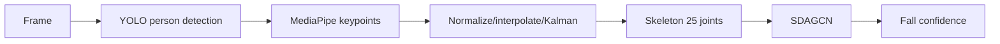

# Vision AI

## Mục tiêu

Module `vision/` thực hiện hai chức năng chính:

- Phát hiện té ngã từ chuỗi skeleton.
- Nhận diện người thân và phát hiện người lạ từ khuôn mặt.

Module này chạy tập trung trên Local Hub duy nhất. Camera chỉ truyền video và không cài model/AI riêng.

Các script dùng đường dẫn tương đối, vì vậy phải chạy từ thư mục `vision/`.

## Pipeline phát hiện ngã



- `feeders/`: chuẩn hóa dữ liệu skeleton và bone pairs.
- `fusion/`: nội suy, lọc Kalman và chuẩn hóa pose.
- `graph/`: đồ thị skeleton NTU RGB+D.
- `model/SDAGCN.py`: kiến trúc phân loại hành vi.
- `main1.py`: train/test entry point.
- `realtime.py`: entry point realtime chính.
- `realtimentu.py`: biến thể joint model cũ, không phải entry point mặc định.

## Pipeline nhận diện khuôn mặt

InsightFace tạo embedding cho khuôn mặt từ webcam. Ảnh đăng ký được lưu local tại `vision/register face/<tên>/`; thư mục này bị Git ignore vì chứa dữ liệu sinh trắc học.

```powershell
cd vision
..\.venv\Scripts\python.exe recognize\capture_data.py
```

Nhấn `c` để bắt đầu/dừng lấy ảnh, `q` để thoát.

## Model files

Model weights không được commit vào Git. Runtime hiện mong đợi:

```text
vision/yolov8n.pt
vision/work_dir/fall_detection/ntu25-bone/config.yaml
vision/work_dir/fall_detection/ntu25-bone/runs-best_val.pt
```

Hai file cấu hình YAML được version control; các file `.pt` phải được cung cấp qua Git LFS, release artifact hoặc kho model nội bộ. Luôn kiểm tra checksum trước khi triển khai.

## Chạy realtime

```powershell
cd vision
..\.venv\Scripts\python.exe realtime.py
```

Runtime tự chọn CUDA khi PyTorch nhận GPU, nếu không sẽ chạy CPU. Máy Intel/Windows 64-bit dùng wheel `win_amd64`; `AMD64` là tên kiến trúc x86-64 chung, không phải yêu cầu CPU AMD.

## Huấn luyện và đánh giá

Ví dụ:

```powershell
cd vision
..\.venv\Scripts\python.exe main1.py --config .\config\vslbone.yaml
```

Output train, checkpoint, TensorBoard events và confusion matrix trong `work_dir/` bị Git ignore. Chỉ đưa metric tổng hợp vào `eval/`; model phát hành nên lưu ngoài Git thường.

## Contract với backend

Vision phải phát một object theo schema `VisionEventRequest`. Các event hỗ trợ:

- `FALL_SUSPECTED`
- `FALL_CONFIRMED`
- `UNKNOWN_PERSON`
- `PERSON_RECOGNIZED`
- `INACTIVITY_DETECTED`
- `CAMERA_OFFLINE`
- `CAMERA_ONLINE`

Không gửi frame thô trong JSON. Snapshot được lưu local và event chỉ mang `snapshot_path`.

## Lưu ý chất lượng

- Không cảnh báo từ một frame đơn lẻ; cần confidence và xác nhận theo thời gian.
- Đánh giá riêng theo góc camera, ánh sáng, che khuất và khoảng cách.
- Không dùng dữ liệu khuôn mặt thật trong repository hoặc log.
- Luôn có lựa chọn human review vì false positive/false negative không thể loại bỏ hoàn toàn.
